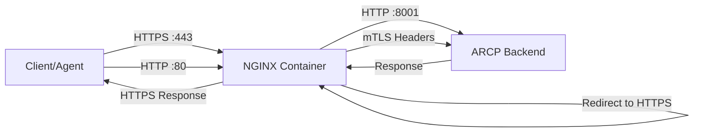

# NGINX Reverse Proxy Deployment

## 📋 Overview

ARCP uses NGINX as a reverse proxy to provide:

- **HTTPS Termination**: Handles SSL/TLS encryption
- **HTTP/2 Support**: Modern protocol with multiplexing
- **Load Balancing**: Connection pooling to backend
- **Security Headers**: Automatic injection of security headers
- **Rate Limiting**: Built-in DDoS protection
- **mTLS Support**: Client certificate validation for enhanced security
- **WebSocket Upgrade**: Seamless WebSocket proxying

### Architecture



**Key Points:**
- Clients connect to NGINX on ports 80 (HTTP) and 443 (HTTPS)
- NGINX redirects all HTTP traffic to HTTPS
- NGINX terminates SSL/TLS and forwards HTTP to ARCP backend
- ARCP backend runs on HTTP internally (not exposed to host)
- Client certificates are validated by NGINX and forwarded to ARCP

---

## 🚀 Quick Start

### 1. Generate SSL Certificates

**Option A: Self-Signed (Development)**

```bash
# Create certs directory
mkdir -p certs

# Generate self-signed certificate
openssl req -x509 -nodes -days 365 -newkey rsa:2048 \
  -keyout certs/server.key \
  -out certs/server.crt \
  -subj "/C=US/ST=State/L=City/O=Organization/CN=localhost"
```

**Option B: Let's Encrypt (Production)**

```bash
# Install certbot
apt-get update && apt-get install certbot

# Generate certificate
certbot certonly --standalone -d your-domain.com

# Copy certificates to certs directory
cp /etc/letsencrypt/live/your-domain.com/fullchain.pem certs/server.crt
cp /etc/letsencrypt/live/your-domain.com/privkey.pem certs/server.key
```

### 2. Configure Environment

Edit `.env`:

```bash
# Backend should NOT handle TLS (NGINX does this)
ARCP_TLS_ENABLED=false

# Certificate files (mounted to NGINX container)
ARCP_TLS_CERT_FILENAME=server.crt
ARCP_TLS_KEY_FILENAME=server.key

# Trust NGINX as reverse proxy
TRUSTED_HOSTS=localhost,127.0.0.1,nginx,arcp
```

### 3. Start Services

```bash
cd deployment/docker
docker compose up -d
```

### 4. Verify NGINX

```bash
# Check NGINX is running
docker ps | grep nginx

# Test HTTPS endpoint
curl -k https://localhost/health

# View NGINX logs
docker logs arcp-nginx

# Follow logs in real-time
docker logs -f arcp-nginx
```

---

## 📁 File Structure

```
project_root/
├── certs/
│   ├── server.crt          # SSL certificate (required)
│   ├── server.key          # SSL private key (required)
│   └── ca-bundle.crt       # CA bundle for mTLS (optional)
├── deployment/
│   ├── nginx/
│   │   └── nginx.conf      # NGINX configuration
│   └── docker/
│       └── docker-compose.yml
└── .env                     # Environment configuration
```

---

## ⚙️ Configuration

### NGINX Container (docker-compose.yml)

```yaml
nginx:
  image: nginx:alpine
  container_name: arcp-nginx
  restart: unless-stopped
  ports:
    - "80:80"    # HTTP (redirects to HTTPS)
    - "443:443"  # HTTPS
  volumes:
    - ../nginx/nginx.conf:/etc/nginx/nginx.conf:ro
    - ../../certs:/etc/nginx/certs:ro
    - nginx_logs:/var/log/nginx
  depends_on:
    arcp:
      condition: service_healthy
  networks:
    - arcp_network
```

### Key Features (nginx.conf)

**1. HTTP to HTTPS Redirect**

```nginx
server {
    listen 80;
    location / {
        return 301 https://$host$request_uri;
    }
}
```

**2. HTTPS Server with mTLS**

```nginx
server {
    listen 443 ssl;
    http2 on;
    
    # SSL certificates
    ssl_certificate /etc/nginx/certs/server.crt;
    ssl_certificate_key /etc/nginx/certs/server.key;
    
    # mTLS (optional client certificate)
    ssl_verify_client optional_no_ca;
    ssl_verify_depth 2;
    
    # Modern TLS configuration
    ssl_protocols TLSv1.2 TLSv1.3;
    ssl_ciphers 'ECDHE-ECDSA-AES128-GCM-SHA256:...';
}
```

**3. Backend Proxy**

```nginx
location / {
    proxy_pass http://arcp:8001;
    
    # Forward client information
    proxy_set_header X-Real-IP $remote_addr;
    proxy_set_header X-Forwarded-For $proxy_add_x_forwarded_for;
    proxy_set_header X-Forwarded-Proto $scheme;
    
    # mTLS: Forward client certificate
    proxy_set_header X-Client-Cert $ssl_client_escaped_cert;
    proxy_set_header X-Client-Verify $ssl_client_verify;
    
    # WebSocket support
    proxy_set_header Upgrade $http_upgrade;
    proxy_set_header Connection "upgrade";
}
```

**4. Rate Limiting**

```nginx
# Define rate limit zones
limit_req_zone $binary_remote_addr zone=api_limit:10m rate=100r/m;
limit_req_zone $binary_remote_addr zone=auth_limit:10m rate=10r/m;

# Apply to locations
location / {
    limit_req zone=api_limit burst=20 nodelay;
}

location ~ ^/(api/auth|api/login) {
    limit_req zone=auth_limit burst=5 nodelay;
}
```

**5. Security Headers**

```nginx
add_header Strict-Transport-Security "max-age=63072000; includeSubDomains; preload" always;
add_header X-Frame-Options "SAMEORIGIN" always;
add_header X-Content-Type-Options "nosniff" always;
add_header X-XSS-Protection "1; mode=block" always;
```

---

## 🔒 mTLS Configuration

### Enable Client Certificate Validation

**1. Prepare CA Bundle**

```bash
# Combine CA certificates
cat intermediate-ca.crt root-ca.crt > certs/ca-bundle.crt
```

**2. Update nginx.conf**

```nginx
server {
    listen 443 ssl;
    
    # SSL certificate
    ssl_certificate /etc/nginx/certs/server.crt;
    ssl_certificate_key /etc/nginx/certs/server.key;
    
    # mTLS: Require client certificate
    ssl_client_certificate /etc/nginx/certs/ca-bundle.crt;
    ssl_verify_client on;  # or 'optional' for mixed mode
    ssl_verify_depth 2;
    
    location / {
        # Forward client cert to backend
        proxy_set_header X-Client-Cert $ssl_client_escaped_cert;
        proxy_set_header X-Client-Verify $ssl_client_verify;
        proxy_set_header X-Client-S-DN $ssl_client_s_dn;
        
        proxy_pass http://arcp:8001;
    }
}
```

**3. Enable in ARCP**

Edit `.env`:

```bash
MTLS_ENABLED=true
MTLS_REQUIRED_REMOTE=true
MTLS_CERT_HEADER=X-Client-Cert
MTLS_VERIFY_CHAIN=true
```

**4. Test with Client Certificate**

```bash
curl --cert client.crt --key client.key \
     --cacert ca-bundle.crt \
     https://localhost/api/agents
```

---

## 🔧 Customization

### Adjust Rate Limits

Edit `deployment/nginx/nginx.conf`:

```nginx
# More restrictive
limit_req_zone $binary_remote_addr zone=api_limit:10m rate=50r/m;

# More permissive
limit_req_zone $binary_remote_addr zone=api_limit:10m rate=200r/m;
```

### Custom SSL Ciphers

```nginx
ssl_ciphers 'ECDHE-ECDSA-AES256-GCM-SHA384:ECDHE-RSA-AES256-GCM-SHA384';
ssl_prefer_server_ciphers on;
```

### Add Custom Headers

```nginx
location / {
    add_header X-Custom-Header "value" always;
    proxy_pass http://arcp:8001;
}
```

### Increase Upload Limit

```nginx
http {
    client_max_body_size 50M;  # Default is 10M
}
```

---

## 🐛 Troubleshooting

### Certificate Errors

**Problem:** "SSL certificate problem: self signed certificate"

**Solution:**
```bash
# Development: Use -k flag to bypass verification
curl -k https://localhost/health

# Production: Use valid CA-signed certificate
# or add self-signed cert to trust store
```

### 502 Bad Gateway

**Problem:** NGINX can't reach backend

**Solution:**
```bash
# Check ARCP container is running
docker ps | grep arcp

# Check ARCP health
docker exec arcp curl http://localhost:8001/health

# Verify network connectivity
docker exec arcp-nginx ping arcp

# Check NGINX logs
docker logs arcp-nginx
```

### WebSocket Connection Failed

**Problem:** WebSocket upgrade not working

**Solution:**
Ensure these headers are set in nginx.conf:
```nginx
proxy_set_header Upgrade $http_upgrade;
proxy_set_header Connection "upgrade";
proxy_http_version 1.1;
```

### Rate Limit Too Restrictive

**Problem:** "429 Too Many Requests"

**Solution:**
```nginx
# Increase burst size
location / {
    limit_req zone=api_limit burst=50 nodelay;
}

# Or increase rate limit
limit_req_zone $binary_remote_addr zone=api_limit:10m rate=200r/m;
```

### Reload Configuration

After modifying nginx.conf:

```bash
# Test configuration
docker exec arcp-nginx nginx -t

# Reload (graceful)
docker exec arcp-nginx nginx -s reload

# Or restart container
docker restart arcp-nginx
```

---

## 📊 Monitoring

### View NGINX Logs

```bash
# Access logs
docker exec arcp-nginx tail -f /var/log/nginx/access.log

# Error logs
docker exec arcp-nginx tail -f /var/log/nginx/error.log

# Logs on host (if volume mounted)
tail -f /var/lib/docker/volumes/arcp_nginx_logs/_data/access.log
```

### Log Format

Access logs include timing information:

```
127.0.0.1 - - [16/Feb/2026:10:30:45 +0000] "GET /api/agents HTTP/2.0" 200 1234 
rt=0.050 uct="0.001" uht="0.005" urt="0.044"
```

Where:
- `rt`: Total request time
- `uct`: Upstream connect time
- `uht`: Upstream header time
- `urt`: Upstream response time

### Health Check

```bash
# NGINX health
curl http://localhost/health

# Backend health (via NGINX)
curl -k https://localhost/health
```

---

## 🔐 Security Best Practices

**✅ Do:**
- Use valid SSL certificates in production
- Enable HSTS (Strict-Transport-Security)
- Keep NGINX updated (use latest alpine image)
- Restrict TLS to 1.2+ only
- Enable rate limiting on all endpoints
- Use mTLS for agent authentication
- Monitor NGINX logs for suspicious activity

**❌ Don't:**
- Use self-signed certificates in production
- Expose ARCP backend directly (always use NGINX)
- Allow weak TLS ciphers (SSL 3.0, TLS 1.0, TLS 1.1)
- Set rate limits too high
- Ignore certificate expiration dates
- Allow unlimited request sizes

---

## 📚 Related Documentation

- [mTLS Client Authentication](../security/mtls.md)
- [Three-Phase Registration](../security/three-phase-registration.md)
- [Security Overview](../security/security-overview.md)
- [Monitoring Setup](./monitoring.md)

---