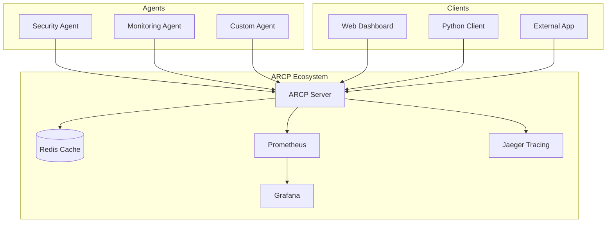

# ARCP - Agent Registry & Control Protocol

[](LICENSE.md)
[](https://www.python.org/downloads/)
[](https://github.com/psf/black)
[](#security)
[](https://badge.fury.io/py/arcp-py)
[](https://www.docker.com/)

**ARCP** (Agent Registry & Control Protocol) is a sophisticated agent orchestration protocol that provides centralized service discovery, registration, communication, and control for distributed agent systems. Built with FastAPI and designed for production environments, ARCP enables seamless communication between agents, microservices, and distributed applications.

## 🚀 Key Features

### 🔧 Centralized Management
- Single point to **register, control, and monitor agents**  
- Manage lifecycle and configuration from one place  

### 🔍 Agent Discovery
- **Semantic Search** using vector embeddings  
- **Real-time updates** through WebSockets  
- **Advanced filtering** by type, capabilities, metrics  

### 🤝 Agent Communication
- Built-in **secure channels** for agent-to-agent collaboration  
- **Real-time messaging** and coordination  

### 🛡️ Security
- **JWT authentication** and **role-based access control** (Admin, Agent, Public)  
- **IP filtering** with allow/deny lists  
- **Rate limiting** against abuse  

### 📊 Dashboard
- **Metrics, logs, and alerts** in real time  
- View agents, unregister them, monitor performance  

### 🐳 Production
- **Docker-ready stack** for deployment  
- Integrated **monitoring and observability tools**  

### ⚙️ Extensible Architecture
- **Modular FastAPI design** with clean service separation  
- **Configuration-driven** customization without code changes  
- **Well-structured codebase** for adding custom functionality  

### 👨‍💻 Developers
- **Python client library** with async support  
- **RESTful API** with OpenAPI  
- Ready-to-use **examples and demos**  

### 📚 Docs
- **Comprehensive guides** for setup and usage  
- **API reference** and advanced topics  

## 🏗️ Architecture



## 🚀 Quick Start

### 1. Start ARCP Server with Docker

```bash
# Clone the repository
git clone https://github.com/0x00K1/ARCP.git
cd ARCP

# Create environment file
cp .env.example .env
# Also copy to deployment/docker directory for Docker Compose
cp .env.example deployment/docker/.env
# Edit .env files with your configuration (see Configuration section below)

# Start the complete stack
docker-compose -f deployment/docker/docker-compose.yml up -d
```

### 2. Access the Services

- **ARCP Server**: http://localhost:8001
- **Web Dashboard**: http://localhost:8001/dashboard (built-in)
- **API Documentation**: http://localhost:8001/docs
- **Grafana**: http://localhost:3000
- **Prometheus**: http://localhost:9090
- **Jaeger**: http://localhost:16686

### 3. Create Your First Agent

```bash
pip install arcp-py
```

```python
import asyncio
from arcp import ARCPClient

async def main():
    # Connect to ARCP server
    client = ARCPClient("http://localhost:8001")
    
    # Register an agent
    agent = await client.register_agent(
        agent_id="my-first-agent",
        name="My First Agent",
        agent_type="testing",
        endpoint="https://my-agent.example.com",
        context_brief="A simple test agent for learning ARCP",
        capabilities=["testing", "demo"],
        owner="tester",
        public_key="my-super-secure-public-key-that-is-at-least-32-chars-long",
        metadata={
            "author": "ARCP User",
            "description": "A simple test agent for learning ARCP",
            "tags": ["demo", "testing", "learning"]
        },
        version="1.0.0",
        communication_mode="remote",
        agent_key="test-agent-001",
    )
    
    print(f"Agent registered: {agent.name}")
    
    # Search for agents
    results = await client.search_agents("find test agents")
    for result in results:
        print(f"Found: {result.name} (similarity: {result.similarity})")

asyncio.run(main())
```

## 📚 Documentation Structure

### Getting Started
- **[Installation](getting-started/installation.md)** - Complete installation guide
- **[Quick Start](getting-started/quickstart.md)** - Get up and running in minutes
- **[Configuration](getting-started/configuration.md)** - Environment variables and settings

### User Guide
- **[Agent Development](user-guide/agent-development.md)** - Building agents that integrate with ARCP
- **[Client Library](user-guide/client-library.md)** - Using the Python client library

### API Reference
- **[REST API](api-reference/rest-api.md)** - Complete API documentation
- **[WebSocket API](api-reference/websocket-api.md)** - Real-time WebSocket API

### Deployment
- **[Monitoring](deployment/monitoring.md)** - Observability and monitoring

### Security
- **[Security Overview](security/security-overview.md)** - Security architecture and practices

## 🎯 Use Cases

### **AI Agent Orchestration**
- Coordinate multiple AI agents for complex tasks
- Load balancing and failover for agent services
- Performance monitoring and optimization

### **Microservices Registry**
- Service discovery for distributed applications
- Health monitoring and automatic failover
- Centralized configuration management

### **IoT Device Management**
- Register and monitor IoT devices
- Real-time status updates and alerts
- Device capability discovery

### **API Gateway**
- Route requests to appropriate services
- Authentication and authorization
- Rate limiting and monitoring

## 🔧 Technology Stack

- **Backend**: FastAPI (Python 3.11+)
- **Database**: Redis for caching and session storage
- **AI**: Azure OpenAI for semantic search
- **Monitoring**: Prometheus + Grafana
- **Tracing**: Jaeger for distributed tracing
- **Containerization**: Docker + Docker Compose
- **Documentation**: MkDocs with Material theme

## 🤝 Contributing

We welcome contributions! Please see our [Contributing Guide](CONTRIBUTING.md) for details.

### Development Setup

```bash
# Install dependencies
poetry install

# Run tests
pytest

# Start development server
python -m arcp
```

## 📄 License

This project is licensed under the Apache License 2.0 - see the [LICENSE](LICENSE.md) file for details.

## 🆘 Support

- **Documentation**: [https://arcp.0x001.tech/docs](https://arcp.0x001.tech/docs)
- **Issues**: [GitHub Issues](https://github.com/0x00K1/ARCP/issues)
- **Discussions**: [GitHub Discussions](https://github.com/0x00K1/ARCP/discussions)

---

**Ready to get started?** Check out our [Quick Start Guide](getting-started/quickstart.md) to have ARCP running in minutes!