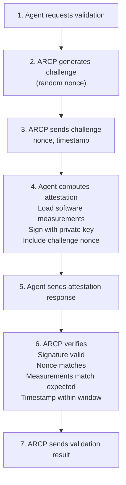

# Software Attestation

**Version:** 2.1.0+  
**Feature Flags:** `ATTESTATION_ENABLED`, `ATTESTATION_REQUIRED`

---

## 📋 Overview

Software attestation provides cryptographic proof that an agent's software has not been tampered with and comes from a trusted source. ARCP supports challenge-response attestation to verify agent integrity before and during operation.

### Why Attestation?

**Without Attestation:**
- ❌ No proof of software integrity
- ❌ Risk of tampered agents
- ❌ Cannot verify software provenance
- ❌ No runtime integrity validation

**With Attestation:**
- ✅ Cryptographic proof of integrity
- ✅ Detect tampering attempts
- ✅ Verify software provenance
- ✅ Periodic integrity checks
- ✅ Compliance with security standards

---

## ⚙️ Configuration

```bash
# Enable attestation verification (default: false)
ATTESTATION_ENABLED=true

# Require attestation for registration - strict mode (default: false)
ATTESTATION_REQUIRED=false

# Attestation type: software or tpm (default: software)
ATTESTATION_TYPE=software

# Challenge TTL in seconds (default: 300)
ATTESTATION_CHALLENGE_TTL=300

# Re-attestation interval in seconds (default: 3600)
ATTESTATION_INTERVAL=3600

# Clock skew tolerance in seconds (default: 300)
ATTESTATION_CLOCK_SKEW=300
```

---

## 🔐 How Attestation Works

### Challenge-Response Flow



---

## 📝 Attestation Format

### Challenge

```json
{
  "nonce": "abc123def456...",
  "timestamp": 1706630400,
  "expires_at": 1706630700
}
```

### Attestation Response

```json
{
  "challenge_nonce": "abc123def456...",
  "timestamp": 1706630401,
  "measurements": {
    "code_hash": "sha256:abc123...",
    "config_hash": "sha256:def456...",
    "dependencies_hash": "sha256:ghi789..."
  },
  "platform": {
    "os": "linux",
    "arch": "x86_64",
    "version": "5.15.0"
  },
  "signature": "base64-encoded-signature"
}
```

---

## 🚀 Usage During TPR

### Phase 2: Validation

ARCP issues an attestation challenge during validation:

```python
# 1. Request validation
validation = await client.validate_compliance(...)

# 2. Receive challenge
challenge = validation["attestation_challenge"]
# {
#   "nonce": "random-123",
#   "timestamp": 1706630400,
#   "expires_at": 1706630700
# }

# 3. Generate attestation
attestation = agent.generate_attestation(challenge)

# 4. Submit attestation
await client.submit_attestation(
    validation_id=validation["validation_id"],
    attestation=attestation
)
```

### Python Implementation

```python
import hashlib
import json
import time
from cryptography.hazmat.primitives import hashes, serialization
from cryptography.hazmat.primitives.asymmetric import padding

class AgentAttestation:
    def __init__(self, private_key, code_path):
        self.private_key = private_key
        self.code_path = code_path
    
    def compute_measurements(self):
        """Compute software measurements"""
        measurements = {}
        
        # Code hash
        code_hash = hashlib.sha256()
        for file in self.get_source_files():
            with open(file, 'rb') as f:
                code_hash.update(f.read())
        measurements['code_hash'] = f"sha256:{code_hash.hexdigest()}"
        
        # Config hash
        config = self.load_config()
        config_str = json.dumps(config, sort_keys=True)
        measurements['config_hash'] = f"sha256:{hashlib.sha256(config_str.encode()).hexdigest()}"
        
        # Dependencies hash (from requirements.txt or package.json)
        deps_hash = self.hash_dependencies()
        measurements['dependencies_hash'] = f"sha256:{deps_hash}"
        
        return measurements
    
    def generate_attestation(self, challenge):
        """Generate attestation response"""
        measurements = self.compute_measurements()
        
        # Build attestation
        attestation = {
            "challenge_nonce": challenge["nonce"],
            "timestamp": int(time.time()),
            "measurements": measurements,
            "platform": {
                "os": platform.system().lower(),
                "arch": platform.machine(),
                "version": platform.release()
            }
        }
        
        # Sign attestation
        attestation_bytes = json.dumps(attestation, sort_keys=True).encode()
        signature = self.private_key.sign(
            attestation_bytes,
            padding.PSS(
                mgf=padding.MGF1(hashes.SHA256()),
                salt_length=padding.PSS.MAX_LENGTH
            ),
            hashes.SHA256()
        )
        
        attestation["signature"] = base64.b64encode(signature).decode()
        
        return attestation
```

---

## 🔍 Verification Process

ARCP validates attestation through these steps:

### 1. Challenge Validation

```python
# Verify challenge is valid and not expired
if challenge["nonce"] != attestation["challenge_nonce"]:
    raise InvalidChallenge()
if time.time() > challenge["expires_at"]:
    raise ChallengeExpired()
```

### 2. Timestamp Validation

```python
# Verify attestation timestamp is within acceptable range
timestamp = attestation["timestamp"]
now = time.time()

if timestamp < challenge["timestamp"]:
    raise AttestationTooOld()
if timestamp > now + ATTESTATION_CLOCK_SKEW:
    raise AttestationFromFuture()
```

### 3. Signature Verification

```python
# Verify signature using agent's public key
public_key = agent.get_public_key()
attestation_data = {k: v for k, v in attestation.items() if k != "signature"}
attestation_bytes = json.dumps(attestation_data, sort_keys=True).encode()

public_key.verify(
    signature_bytes,
    attestation_bytes,
    padding.PSS(
        mgf=padding.MGF1(hashes.SHA256()),
        salt_length=padding.PSS.MAX_LENGTH
    ),
    hashes.SHA256()
)
```

### 4. Measurement Validation

```python
# Verify measurements match expected values
expected_measurements = get_expected_measurements(agent_id)

for key, expected_value in expected_measurements.items():
    if attestation["measurements"][key] != expected_value:
        raise MeasurementMismatch(key)
```

---

## 🔄 Periodic Re-Attestation

### Continuous Verification

ARCP can request periodic re-attestation to ensure ongoing integrity:

```bash
# Re-attestation interval (default: 1 hour)
ATTESTATION_INTERVAL=3600
```

### Agent Implementation

```python
import asyncio

async def attestation_loop(client, agent):
    while True:
        # Wait for interval
        await asyncio.sleep(ATTESTATION_INTERVAL)
        
        try:
            # Request challenge
            challenge = await client.request_attestation_challenge()
            
            # Generate attestation
            attestation = agent.generate_attestation(challenge)
            
            # Submit
            await client.submit_attestation(attestation)
            
            logger.info("Re-attestation successful")
        except Exception as e:
            logger.error(f"Re-attestation failed: {e}")
```

---

## 🎯 Best Practices

**✅ Do:**
- Store measurements securely
- Use hardware-backed keys when available (TPM, HSM)
- Implement measurement caching
- Re-attest periodically
- Monitor attestation failures

**❌ Don't:**
- Hardcode expected measurements
- Skip signature verification
- Use weak cryptographic algorithms
- Allow expired challenges
- Ignore attestation failures

---

## 🐛 Troubleshooting

### Challenge Expired

```json
{
  "error": "Attestation challenge has expired"
}
```

**Solution:**
- Request fresh challenge
- Increase `ATTESTATION_CHALLENGE_TTL`
- Check system clock synchronization

### Measurement Mismatch

```json
{
  "error": "Code hash does not match expected value"
}
```

**Solution:**
- Verify code hasn't been modified
- Update expected measurements
- Check measurement computation logic

### Signature Invalid

```json
{
  "error": "Attestation signature verification failed"
}
```

**Solution:**
- Ensure using correct private key
- Verify public key is registered
- Check signature algorithm matches

---

## 📚 Related Documentation

- [Three-Phase Registration](./three-phase-registration.md)
- [DPoP (Proof-of-Possession)](./dpop.md)
- [Security Overview](./security-overview.md)

---

**Last Updated:** February 16, 2026  
**Version:** 2.1.0
