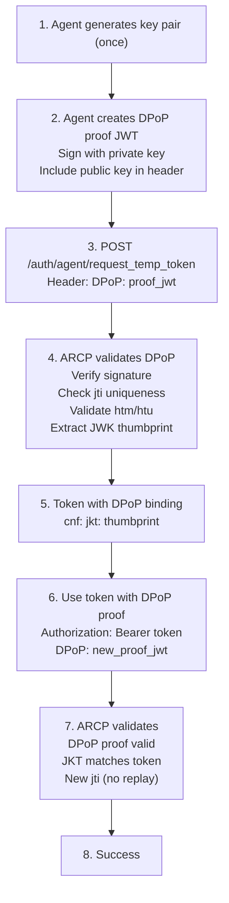

# DPoP (Demonstrating Proof-of-Possession)

**Version:** 2.1.0+  
**RFC:** [RFC 9449](https://datatracker.ietf.org/doc/html/rfc9449)  
**Feature Flags:** `DPOP_ENABLED`, `DPOP_REQUIRED`

---

## 📋 Overview

DPoP (Demonstrating Proof-of-Possession) is a security mechanism defined in RFC 9449 that binds access tokens to specific cryptographic key pairs. This prevents token theft and replay attacks by ensuring that stolen tokens cannot be used by attackers who don't possess the corresponding private key.

### Why DPoP?

**Traditional Bearer Tokens:**
- ❌ Anyone with the token can use it
- ❌ Stolen tokens work until expiration
- ❌ No proof of legitimate ownership
- ❌ Man-in-the-middle attacks possible

**DPoP Solutions:**
- ✅ Tokens bound to cryptographic keys
- ✅ Stolen tokens are useless without private key
- ✅ Proof-of-possession for every request
- ✅ Replay attack prevention
- ✅ Strong cryptographic verification

---

## 🔐 How DPoP Works

### Core Concept

Every request includes a **DPoP proof** - a JWT signed with the client's private key that demonstrates possession of the key associated with the access token.

### Flow Diagram



---

## 🛠️ DPoP Proof Structure

### JWT Header

```json
{
  "typ": "dpop+jwt",
  "alg": "EdDSA",
  "jwk": {
    "kty": "OKP",
    "crv": "Ed25519",
    "x": "base64url-encoded-public-key"
  }
}
```

**Required Fields:**
- `typ`: Must be `dpop+jwt`
- `alg`: Signing algorithm (EdDSA, ES256, RS256)
- `jwk`: Public key in JWK format

### JWT Payload

```json
{
  "jti": "unique-identifier-123",
  "htm": "POST",
  "htu": "https://arcp.example.com/auth/agent/request_temp_token",
  "iat": 1706630400,
  "ath": "fUHyO2r2Z3DZ53EsNrWBb0xWXoaNy59IiKCAqksmQEo"
}
```

**Required Claims:**
- `jti`: Unique identifier (prevents replay)
- `htm`: HTTP method (POST, GET, etc.)
- `htu`: HTTP URI (without query/fragment)
- `iat`: Issued at timestamp (Unix epoch)

**Optional Claims:**
- `ath`: Access token hash (base64url SHA-256)
- `nonce`: Server-provided nonce (future extension)

---

## ⚙️ Configuration

### Enable DPoP

```bash
# Accept DPoP proofs (default: true)
DPOP_ENABLED=true

# Require DPoP for all token requests (default: false)
DPOP_REQUIRED=true

# DPoP proof validity window in seconds (default: 120)
DPOP_PROOF_TTL=120

# Allowed clock skew in seconds (default: 60)
DPOP_CLOCK_SKEW=60

# Allowed signing algorithms (comma-separated)
DPOP_ALGORITHMS=EdDSA,ES256,RS256
```

### Configuration Modes

**Mode 1: Optional DPoP (Development)**
```bash
DPOP_ENABLED=true   # Accept DPoP if provided
DPOP_REQUIRED=false # Don't require it
```
- Clients can use DPoP or bearer tokens
- Good for testing and gradual rollout

**Mode 2: Required DPoP (Production)**
```bash
DPOP_ENABLED=true   # Accept DPoP
DPOP_REQUIRED=true  # Require it for all requests
```
- All requests must include DPoP proof
- Maximum security
- Recommended for production

**Mode 3: Disabled (Legacy)**
```bash
DPOP_ENABLED=false  # Ignore DPoP
```
- DPoP proofs ignored
- Standard bearer tokens only

---

## 🔨 Implementation Guide

### Step 1: Generate Key Pair

Generate a key pair for your agent (do this once, store securely):

> **Note:** Copy `dpop_helper.py` from `examples/agents/` to your project.

```python
from cryptography.hazmat.primitives.asymmetric import ed25519

# Generate Ed25519 key pair (recommended)
private_key = ed25519.Ed25519PrivateKey.generate()
public_key = private_key.public_key()

# Or use the helper (after copying dpop_helper.py to your project):
from dpop_helper import DPoPGenerator

dpop_gen = DPoPGenerator(algorithm="EdDSA")
jkt = dpop_gen.jkt  # JWK Thumbprint for token binding
```

**Supported Algorithms:**
- **EdDSA (Ed25519)** - Recommended, fast, secure
- **ES256 (P-256)** - ECDSA with SHA-256
- **RS256 (RSA)** - RSA with SHA-256 (legacy support)

### Step 2: Create DPoP Proof

For each request, create a new DPoP proof:

```python
import time
import uuid
import jwt
from cryptography.hazmat.primitives import serialization

# Create DPoP proof
proof = jwt.encode(
    {
        "jti": str(uuid.uuid4()),
        "htm": "POST",
        "htu": "https://arcp.example.com/auth/agent/request_temp_token",
        "iat": int(time.time())
    },
    private_key,
    algorithm="EdDSA",
    headers={
        "typ": "dpop+jwt",
        "jwk": {
            "kty": "OKP",
            "crv": "Ed25519",
            "x": base64url_encode(public_key_bytes)
        }
    }
)
```

### Step 3: Include in Request

Send the DPoP proof in the `DPoP` header:

```bash
curl -X POST "https://arcp.example.com/auth/agent/request_temp_token" \
  -H "Content-Type: application/json" \
  -H "DPoP: eyJ0eXAiOiJkcG9wK2p3dCIsImFsZyI6IkVkRFNBIiwiandrIjp7Imt0eSI6Ik9LUCIsImNydiI6IkVkMjU1MTkiLCJ4IjoiYWJjMTIzIn19.eyJqdGkiOiJ0ZXN0LWp0aSIsImh0bSI6IlBPU1QiLCJodHUiOiJodHRwczovL2FyY3AuZXhhbXBsZS5jb20vYXV0aC9hZ2VudC9yZXF1ZXN0X3RlbXBfdG9rZW4iLCJpYXQiOjE3MDY2MzA0MDB9.signature" \
  -d '{
    "agent_id": "my-agent",
    "agent_type": "automation",
    "agent_key": "your-key"
  }'
```

### Step 4: Use Token with DPoP

When using the token, include a fresh DPoP proof:

```bash
curl -X POST "https://arcp.example.com/auth/agent/validate_compliance" \
  -H "Authorization: Bearer <temp_token>" \
  -H "DPoP: <new_dpop_proof>" \
  -H "Content-Type: application/json" \
  -d '{...}'
```

**Important:** Each request needs a **new** DPoP proof with:
- Fresh `jti` (must be unique)
- Correct `htm` (HTTP method)
- Correct `htu` (request URI)
- Current `iat` (within TTL window)

---

## 🐍 Python Client Example

### Using the DPoP Client

> **Note:** The `examples/agents/` directory is not part of the installable package. Copy the `dpop_client.py` and `dpop_helper.py` files to your project, or use the code below as a reference to build your own DPoP-enabled client.

```python
import asyncio
# After copying dpop_client.py to your project:
from dpop_client import DPoPARCPClient

async def main():
    # Create DPoP-enabled client
    client = DPoPARCPClient(
        base_url="https://arcp.example.com",
        dpop_enabled=True,
        dpop_algorithm="EdDSA"
    )
    
    # Get JWK Thumbprint for reference
    jkt = client.get_dpop_jkt()
    print(f"DPoP JKT: {jkt}")
    
    # All requests automatically include DPoP proofs
    
    # Phase 1: Request temp token
    temp_response = await client.request_temp_token(
        agent_id="my-agent",
        agent_type="automation",
        agent_key="your-key"
    )
    
    # Phase 2: Validate (DPoP proof auto-generated)
    validation = await client.validate_compliance(
        temp_token=temp_response["temp_token"],
        agent_data={
            "agent_id": "my-agent",
            "endpoint": "https://agent.example.com",
            "capabilities": ["processing"]
        }
    )
    
    # Phase 3: Register (DPoP proof auto-generated)
    agent = await client.register_agent(
        validated_token=validation["validated_token"],
        agent_data={...}
    )

asyncio.run(main())
```

### Manual DPoP Generation

```python
# After copying dpop_helper.py to your project:
from dpop_helper import DPoPGenerator

# Create generator
dpop_gen = DPoPGenerator(algorithm="EdDSA")

# Generate proof for a request
proof = dpop_gen.create_proof(
    method="POST",
    uri="https://arcp.example.com/auth/agent/request_temp_token",
    access_token=None  # Include if binding to existing token
)

# Use in request
headers = {
    "DPoP": proof,
    "Content-Type": "application/json"
}
```

---

## 🔍 Validation Process

ARCP validates DPoP proofs through these steps:

### 1. Structural Validation

- ✅ JWT format valid
- ✅ Header contains `typ=dpop+jwt`
- ✅ Header contains `jwk` with public key
- ✅ Algorithm is allowed (`DPOP_ALGORITHMS`)

### 2. Signature Verification

- ✅ Signature valid using embedded JWK
- ✅ JWK is valid and well-formed

### 3. Claims Validation

- ✅ `jti` present and unique (not used before)
- ✅ `htm` matches HTTP method
- ✅ `htu` matches request URI (scheme, host, path)
- ✅ `iat` within acceptable time window

### 4. Replay Prevention

- ✅ `jti` tracked in Redis
- ✅ Each `jti` can only be used once
- ✅ Expired proofs automatically cleaned up

### 5. Token Binding (if applicable)

- ✅ `ath` (access token hash) matches
- ✅ JKT (JWK thumbprint) matches token's `cnf.jkt`

---

## 🔒 Security Features

### Replay Attack Prevention

Each DPoP proof has a unique `jti` tracked in Redis:

```python
# Proof lifecycle
jti = "abc-123-def-456"
redis_key = f"arcp:dpop:jti:{jti}"

# First use: Store jti
redis.setex(redis_key, ttl=DPOP_PROOF_TTL, value="1")

# Subsequent use: Rejected
if redis.exists(redis_key):
    raise ReplayAttackDetected()
```

### Time Window Validation

Proofs are only valid within a time window:

```python
proof_time = iat  # From proof
current_time = time.time()

# Check if too old
if current_time - proof_time > DPOP_PROOF_TTL:
    raise ProofExpired()

# Check if too new (clock skew tolerance)
if proof_time - current_time > DPOP_CLOCK_SKEW:
    raise ProofFromFuture()
```

### JWK Thumbprint (JKT)

The JKT is a SHA-256 hash of the public key in canonical form:

```python
import hashlib
import json
import base64

# Canonical JWK (ordered keys)
jwk_canonical = json.dumps(
    {"crv": "Ed25519", "kty": "OKP", "x": "..."},
    separators=(",", ":"),
    sort_keys=True
)

# Compute thumbprint
jkt = base64.urlsafe_b64encode(
    hashlib.sha256(jwk_canonical.encode()).digest()
).decode().rstrip("=")
```

This JKT is embedded in tokens:

```json
{
  "sub": "agent-123",
  "cnf": {
    "jkt": "abc123def456..."
  }
}
```

### HTTP Method & URI Binding

DPoP proofs are bound to specific HTTP requests:

```python
# Proof claims
{
  "htm": "POST",  # Must match request method
  "htu": "https://arcp.example.com/auth/agent/request_temp_token"  # Must match request URI
}

# Validation
if proof_htm != request.method:
    raise MethodMismatch()
if proof_htu != f"{request.scheme}://{request.host}{request.path}":
    raise URIMismatch()
```

---

## 🐛 Troubleshooting

### Common Errors

**1. DPoP Required But Not Provided**

```json
{
  "type": "https://arcp.0x001.tech/docs/problems/dpop-required",
  "title": "DPoP Proof Required",
  "status": 401,
  "detail": "This endpoint requires a DPoP proof header"
}
```

**Solution:**
- Set `dpop_enabled=True` in your client
- Include `DPoP` header in all requests

---

**2. Invalid DPoP Proof**

```json
{
  "type": "https://arcp.0x001.tech/docs/problems/dpop-invalid",
  "title": "Invalid DPoP Proof",
  "status": 401,
  "detail": "DPoP proof validation failed: Invalid signature"
}
```

**Common causes:**
- Wrong algorithm used
- Signature doesn't match JWK
- JWK malformed

**Solution:**
- Verify algorithm is in `DPOP_ALGORITHMS`
- Check signature generation code
- Validate JWK format

---

**3. DPoP Binding Mismatch**

```json
{
  "type": "https://arcp.0x001.tech/docs/problems/dpop-binding-mismatch",
  "title": "DPoP Binding Mismatch",
  "status": 401,
  "detail": "Token JKT does not match DPoP proof"
}
```

**Solution:**
- Use the same key pair for all requests
- Don't switch keys mid-session
- Check JKT calculation

---

**4. Replay Attack Detected**

```json
{
  "type": "https://arcp.0x001.tech/docs/problems/dpop-invalid",
  "title": "Invalid DPoP Proof",
  "status": 401,
  "detail": "DPoP jti already used (replay attack)"
}
```

**Solution:**
- Generate fresh `jti` for each request
- Use `uuid.uuid4()` or similar
- Don't reuse DPoP proofs

---

**5. HTTP Method Mismatch**

```json
{
  "type": "https://arcp.0x001.tech/docs/problems/dpop-invalid",
  "title": "Invalid DPoP Proof",
  "status": 401,
  "detail": "DPoP htm does not match request method"
}
```

**Solution:**
- Ensure `htm` matches actual HTTP method
- Use uppercase (POST, GET, not post, get)

---

**6. URI Mismatch**

```json
{
  "type": "https://arcp.0x001.tech/docs/problems/dpop-invalid",
  "title": "Invalid DPoP Proof",
  "status": 401,
  "detail": "DPoP htu does not match request URI"
}
```

**Solution:**
- Include full URI (scheme + host + path)
- Don't include query parameters or fragment
- Match exactly: `https://arcp.example.com/path`

---

**7. Proof Expired**

```json
{
  "type": "https://arcp.0x001.tech/docs/problems/dpop-invalid",
  "title": "Invalid DPoP Proof",
  "status": 401,
  "detail": "DPoP proof has expired"
}
```

**Solution:**
- Generate fresh proof for each request
- Don't cache/reuse old proofs
- Check system clock synchronization

---

## 🎯 Best Practices

### Key Management

**✅ Do:**
- Generate strong keys (Ed25519 recommended)
- Store private keys securely (encrypted at rest)
- Rotate keys periodically
- Use hardware security modules (HSM) for critical agents

**❌ Don't:**
- Share private keys between agents
- Store keys in code repositories
- Use weak algorithms (RSA < 2048 bits)
- Reuse keys across environments

### Proof Generation

**✅ Do:**
- Generate fresh proof for every request
- Use secure random for `jti`
- Include current timestamp in `iat`
- Validate proofs before sending (self-test)

**❌ Don't:**
- Reuse DPoP proofs
- Use predictable `jti` values
- Cache proofs for reuse
- Use old timestamps

### Error Handling

```python
from arcp.core.exceptions import DPoPException

try:
    response = await client.request_with_dpop(...)
except DPoPException as e:
    if "replay" in str(e):
        # Generate new proof and retry
        response = await client.request_with_dpop(...)
    elif "binding_mismatch" in str(e):
        # Key mismatch - regenerate key pair
        client.regenerate_keys()
    else:
        # Other error - log and alert
        logger.error(f"DPoP error: {e}")
```

### Performance

**Optimize for high-throughput:**
```python
# Pre-compute JWK once
jwk = compute_jwk(public_key)

# Reuse for all proofs (but not the proofs themselves!)
for request in requests:
    proof = generate_proof(
        private_key=private_key,
        jwk=jwk,  # Reuse this
        jti=uuid.uuid4(),  # Fresh for each
        ...
    )
```

---

## 📊 Performance Impact

### Overhead Analysis

**DPoP Proof Generation:**
- EdDSA signing: ~0.1ms
- JWK encoding: ~0.01ms
- **Total:** < 1ms per request

**DPoP Proof Validation:**
- Signature verification: ~0.2ms
- JTI lookup (Redis): ~1ms
- Claims validation: ~0.1ms
- **Total:** ~1.5ms per request

**Overall Impact:** < 2ms added latency per request

### Scaling Considerations

For high-throughput deployments:

```bash
# Use Redis for jti tracking
REDIS_HOST=redis-cluster.example.com

# Adjust TTL for your use case
DPOP_PROOF_TTL=60  # Shorter = less storage, more strict

# Tune clock skew for your environment
DPOP_CLOCK_SKEW=30  # Tighter = better security, needs accurate clocks
```

---

## 🔗 Related Documentation

- [Three-Phase Registration (TPR)](./three-phase-registration.md)
- [mTLS Client Certificates](./mtls.md)
- [JWKS & Token Signing](./jwks.md)
- [Security Overview](./security-overview.md)
- [RFC 9449 - OAuth 2.0 Demonstrating Proof of Possession](https://datatracker.ietf.org/doc/html/rfc9449)

---

## 📚 Additional Resources

### Implementation Examples

See the complete implementation examples in the `examples/agents/` directory of the ARCP repository:
- `dpop_client.py` - DPoP-enabled ARCP client
- `dpop_helper.py` - DPoP proof generator

### Test Suite

Comprehensive test coverage is available in the `tests/` directory:
- `tests/unit/utils/test_dpop.py` - Unit tests
- `tests/security/test_tpr_security.py` - Security tests

---

**Last Updated:** February 16, 2026  
**Version:** 2.1.0
