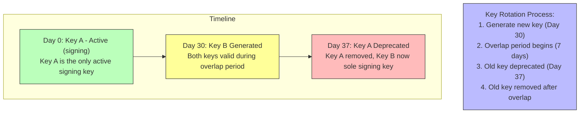
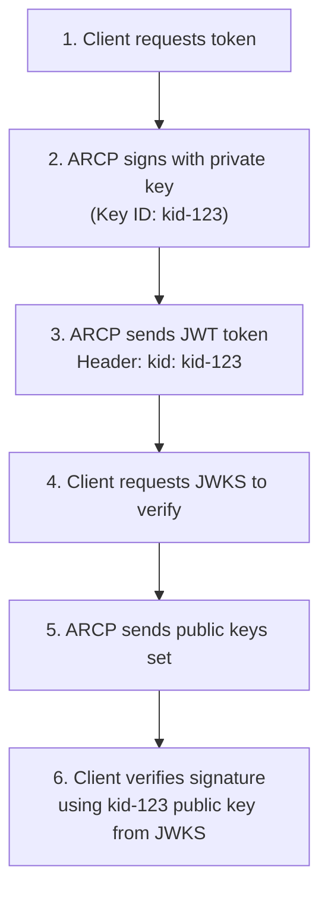

# JSON Web Key Set (JWKS) Management

**Version:** 2.1.0+  
**Feature Flags:** `JWKS_ENABLED`, `JWKS_KEY_ROTATION_ENABLED`

---

## 📋 Overview

JWKS (JSON Web Key Set) provides asymmetric cryptographic signing for ARCP tokens, replacing symmetric HMAC-HS256 with more secure RSA or ECDSA signatures. This enables:

- **Public Key Distribution**: Clients can verify tokens without sharing secrets
- **Key Rotation**: Seamlessly rotate signing keys without downtime
- **Multiple Keys**: Support gradual key rollover
- **Enhanced Security**: Asymmetric cryptography eliminates shared secret risks

### HS256 vs EdDSA

| Feature | HS256 (Symmetric) | EdDSA (Asymmetric) |
|---------|-------------------|--------------------|
| **Secret Sharing** | Server and clients share same secret | Only server has private key |
| **Verification** | Same key signs and verifies | Public key verifies, private key signs |
| **Key Distribution** | High risk (secret exposure) | Low risk (public key is safe) |
| **Key Rotation** | All clients must update | Clients fetch new public key automatically |
| **Security** | Good for single service | Better for distributed systems |
| **Performance** | Faster (symmetric) | Fast (Ed25519 is highly optimized) |

---

## ⚙️ Configuration

```bash
# Enable JWKS asymmetric signing (default: false)
JWKS_ENABLED=true

# Key algorithm (EdDSA or ES256, default: EdDSA)
JWKS_ALGORITHM=EdDSA

# Days between automatic key rotations (default: 30 days)
JWKS_ROTATION_DAYS=30

# Days old keys remain valid after rotation for graceful transition (default: 7 days)
JWKS_OVERLAP_DAYS=7

# ARCP issuer URL for token claims and discovery
ARCP_ISSUER=https://arcp.example.com
```

**Note:** Key rotation happens automatically every `JWKS_ROTATION_DAYS` days. During the overlap period (`JWKS_OVERLAP_DAYS`), both old and new keys can verify tokens, enabling zero-downtime rotation.

---

## 🔐 How JWKS Works

### Key Lifecycle



**Rotation Strategy:**
- **Day 0-30**: Key A signs all new tokens
- **Day 30-37**: Key B generated, both keys can verify tokens (overlap)
- **Day 37+**: Key A removed, Key B signs all new tokens

### Token Signature Flow



---

## 📝 JWKS Format

### JWKS Endpoint Response

```json
{
  "keys": [
    {
      "kty": "OKP",
      "crv": "Ed25519",
      "x": "base64url-encoded-public-key",
      "kid": "arcp-2026-02-16-001",
      "use": "sig",
      "alg": "EdDSA"
    },
    {
      "kty": "OKP",
      "crv": "Ed25519",
      "x": "base64url-encoded-public-key-old",
      "kid": "arcp-2026-02-09-001",
      "use": "sig",
      "alg": "EdDSA"
    }
  ]
}
```

**Supported Algorithms:**
- **EdDSA (Ed25519)** - Default, recommended for performance and security
- **ES256 (P-256)** - ECDSA with SHA-256, alternative option

### JWT Token Header

```json
{
  "typ": "JWT",
  "alg": "EdDSA",
  "kid": "arcp-2026-02-16-001"
}
```

---

## 🚀 Setup and Usage

### Server-Side Configuration

```python
from cryptography.hazmat.primitives.asymmetric.ed25519 import Ed25519PrivateKey
from cryptography.hazmat.primitives import serialization
import json

class JWKSManager:
    def __init__(self, config):
        self.config = config
        self.keys = {}
        self.current_key_id = None
        
    async def initialize(self):
        """Initialize JWKS with first key"""
        if not self.config.JWKS_ENABLED:
            return
            
        # Generate initial key pair
        await self.rotate_keys()
    
    async def rotate_keys(self):
        """Generate new key pair and add to JWKS"""
        # Generate Ed25519 key pair (default algorithm)
        private_key = Ed25519PrivateKey.generate()
        
        # Generate key ID with timestamp
        key_id = f"arcp-{datetime.now().strftime('%Y%m%d-%H%M%S')}"
        
        # Store key pair
        self.keys[key_id] = {
            "private_key": private_key,
            "public_key": private_key.public_key(),
            "created_at": datetime.now(),
            "algorithm": self.config.JWKS_ALGORITHM
        }
        
        # Set as current signing key
        self.current_key_id = key_id
        
        # Clean up old keys
        await self._cleanup_old_keys()
        
        logger.info(f"Rotated to new key: {key_id}")
    
    def get_jwks(self):
        """Return public JWKS for clients"""
        keys = []
        
        for kid, key_data in self.keys.items():
            public_key = key_data["public_key"]
            algorithm = key_data["algorithm"]
            
            if algorithm == "EdDSA":
                # Export Ed25519 public key
                public_bytes = public_key.public_bytes(
                    encoding=serialization.Encoding.Raw,
                    format=serialization.PublicFormat.Raw
                )
                
                keys.append({
                    "kty": "OKP",
                    "crv": "Ed25519",
                    "use": "sig",
                    "kid": kid,
                    "alg": "EdDSA",
                    "x": self._base64url_encode(public_bytes)
                })
            elif algorithm == "ES256":
                # Export EC P-256 public key
                public_numbers = public_key.public_numbers()
                
                keys.append({
                    "kty": "EC",
                    "crv": "P-256",
                    "use": "sig",
                    "kid": kid,
                    "alg": "ES256",
                    "x": self._base64url_encode(public_numbers.x),
                    "y": self._base64url_encode(public_numbers.y)
                })
        
        return {"keys": keys}
    
    def sign_token(self, payload):
        """Sign JWT with current private key"""
        key_data = self.keys[self.current_key_id]
        
        # Add kid to header
        headers = {"kid": self.current_key_id}
        
        token = jwt.encode(
            payload,
            key_data["private_key"],
            algorithm=key_data["algorithm"],
            headers=headers
        )
        
        return token
```

### JWKS Endpoint

```python
from fastapi import APIRouter

router = APIRouter()

@router.get("/.well-known/jwks.json")
async def get_jwks():
    """Public JWKS endpoint for token verification"""
    jwks = jwks_manager.get_jwks()
    
    return JSONResponse(
        content=jwks,
        headers={
            "Cache-Control": "public, max-age=3600",
            "Content-Type": "application/json"
        }
    )
```

---

## 🔍 Client-Side Verification

### Python Client

```python
import jwt
import requests
from jwt import PyJWKClient

class ARCPClient:
    def __init__(self, base_url):
        self.base_url = base_url
        self.jwks_client = PyJWKClient(
            f"{base_url}/.well-known/jwks.json",
            cache_keys=True,
            max_cached_keys=10
        )
    
    def verify_token(self, token):
        """Verify JWT token using JWKS"""
        try:
            # Decode header to get kid
            header = jwt.get_unverified_header(token)
            kid = header.get("kid")
            
            if not kid:
                raise ValueError("No kid in token header")
            
            # Fetch signing key from JWKS
            signing_key = self.jwks_client.get_signing_key_from_jwt(token)
            
            # Verify token
            payload = jwt.decode(
                token,
                signing_key.key,
                algorithms=["EdDSA", "ES256"],  # Support both EdDSA and ES256
                audience="arcp-agent",
                options={"verify_exp": True}
            )
            
            return payload
            
        except jwt.ExpiredSignatureError:
            raise TokenExpired()
        except jwt.InvalidTokenError as e:
            raise TokenInvalid(str(e))
```

### JavaScript/TypeScript Client

```typescript
import jwksClient from 'jwks-rsa';
import jwt from 'jsonwebtoken';

class ARCPClient {
  private jwksClient: jwksClient.JwksClient;
  
  constructor(baseUrl: string) {
    this.jwksClient = jwksClient({
      jwksUri: `${baseUrl}/.well-known/jwks.json`,
      cache: true,
      cacheMaxAge: 3600000, // 1 hour
    });
  }
  
  async verifyToken(token: string): Promise<any> {
    return new Promise((resolve, reject) => {
      // Get kid from header
      const decoded = jwt.decode(token, { complete: true });
      if (!decoded?.header?.kid) {
        return reject(new Error('No kid in token'));
      }
      
      // Fetch signing key
      this.jwksClient.getSigningKey(decoded.header.kid, (err, key) => {
        if (err) {
          return reject(err);
        }
        
        const signingKey = key.getPublicKey();
        
        // Verify token
        jwt.verify(token, signingKey, {
          algorithms: ['EdDSA', 'ES256'],  // Support both EdDSA and ES256
          audience: 'arcp-agent',
        }, (err, payload) => {
          if (err) return reject(err);
          resolve(payload);
        });
      });
    });
  }
}
```

---

## 🔄 Key Rotation

### Automatic Rotation

ARCP automatically rotates keys based on `JWKS_KEY_ROTATION_INTERVAL`:

```python
async def _rotation_task(self):
    """Background task for automatic key rotation"""
    while True:
        # Wait for rotation interval (convert days to seconds)
        await asyncio.sleep(self.config.JWKS_ROTATION_DAYS * 86400)
        
        try:
            await self.rotate_keys()
            logger.info("Automatic key rotation successful")
        except Exception as e:
            logger.error(f"Key rotation failed: {e}")
```

### Manual Rotation

```bash
# Trigger manual rotation via API
curl -X POST http://localhost:8000/admin/jwks/rotate \
  -H "Authorization: Bearer $ADMIN_TOKEN"
```

### Graceful Rotation Strategy

```python
async def _cleanup_old_keys(self):
    """Remove keys older than overlap period"""
    now = datetime.now()
    overlap = timedelta(days=self.config.JWKS_OVERLAP_DAYS)
    
    keys_to_remove = []
    
    for kid, key_data in self.keys.items():
        # Keep current key
        if kid == self.current_key_id:
            continue
        
        # Remove if older than overlap period
        age = now - key_data["created_at"]
        if age > overlap:
            keys_to_remove.append(kid)
    
    for kid in keys_to_remove:
        del self.keys[kid]
        logger.info(f"Removed expired key: {kid}")
```

---

## 🎯 Best Practices

**✅ Do:**
- Use EdDSA (Ed25519) for best performance and security (default)
- Use ES256 (P-256) as alternative for compatibility
- Rotate keys regularly (30 days recommended)
- Maintain overlap period (7 days minimum)
- Cache JWKS responses on client
- Use Redis-backed storage in production
- Monitor key rotation logs

**❌ Don't:**
- Use HS256 in distributed systems (use EdDSA/ES256 instead)
- Rotate keys without overlap period
- Hard-code public keys in clients
- Skip kid validation
- Ignore rotation failures

---

## 🐛 Troubleshooting

### No Matching Key

```json
{
  "error": "Unable to find a signing key that matches 'kid-123'"
}
```

**Solution:**
- Ensure JWKS endpoint is accessible
- Check client is fetching latest JWKS
- Verify token kid matches available keys
- Increase `JWKS_OVERLAP_DAYS` if rotation is too frequent

### Signature Verification Failed

```json
{
  "error": "Signature verification failed"
}
```

**Solution:**
- Ensure using correct algorithm (EdDSA or ES256, not HS256)
- Verify JWKS endpoint returns valid keys
- Check token hasn't been tampered with
- Clear client-side JWKS cache
- Verify algorithm in JWT header matches JWKS

### Key Rotation Failures

```
ERROR: Key rotation failed: Redis connection error
```

**Solution:**
- Check Redis connection is available
- Verify Redis service is running
- Ensure sufficient memory in Redis
- Check rotation task is running
- Review logs for specific error details

---

## 📚 Related Documentation

- [DPoP (Proof-of-Possession)](./dpop.md)
- [mTLS Client Authentication](./mtls.md)
- [Security Overview](./security-overview.md)

---

**Last Updated:** February 16, 2026  
**Version:** 2.1.0
