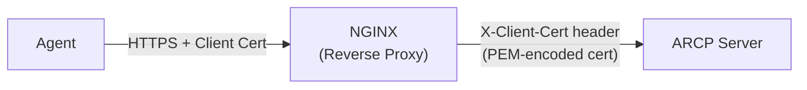
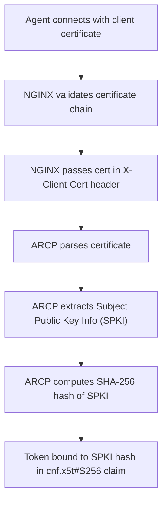

# mTLS (Mutual TLS) Client Certificate Authentication

**Version:** 2.1.0+  
**Feature Flags:** `MTLS_ENABLED`, `MTLS_REQUIRED_REMOTE`

---

## 📋 Overview

Mutual TLS (mTLS) provides strong cryptographic authentication using X.509 client certificates. Unlike server-only TLS where only the server proves its identity, mTLS requires both parties to authenticate, providing bidirectional trust.

### Why mTLS?

**Traditional Authentication:**
- ❌ Password-based (vulnerable to phishing)
- ❌ API keys (can be stolen)
- ❌ Single-factor authentication
- ❌ No hardware-backed security

**mTLS Solutions:**
- ✅ Certificate-based (hardware-backed possible)
- ✅ Mutual authentication (both parties verified)
- ✅ Cryptographically strong
- ✅ Resistant to credential theft
- ✅ Perfect for machine-to-machine communication

---

## 🔐 How mTLS Works in ARCP

### Architecture



### ARCP's mTLS Model

ARCP uses a **reverse proxy pattern** where:

1. **NGINX** handles TLS termination
2. **NGINX** validates client certificates
3. **NGINX** forwards certificate to ARCP in HTTP header
4. **ARCP** extracts and validates certificate details
5. **ARCP** computes SPKI hash for token binding

### Certificate Flow



---

## 🛠️ Configuration

### ARCP Configuration

```bash
# Enable mTLS support (default: false)
MTLS_ENABLED=true

# Require cert for remote agents (not localhost)
MTLS_REQUIRED_REMOTE=true

# Header name from reverse proxy
MTLS_CERT_HEADER=X-Client-Cert

# Verify certificate chain against CA
MTLS_VERIFY_CHAIN=false

# Path to CA certificate bundle (optional)
# MTLS_CA_BUNDLE=/path/to/ca-bundle.pem

# Enable certificate revocation checking (OCSP/CRL)
MTLS_CHECK_REVOCATION=false

# Revocation check timeouts
MTLS_OCSP_TIMEOUT=5          # OCSP request timeout (seconds)
MTLS_CRL_CACHE_TTL=3600      # CRL cache TTL (seconds)
MTLS_CRL_TIMEOUT=10          # CRL download timeout (seconds)

# Soft-fail on revocation check errors
MTLS_REVOCATION_SOFT_FAIL=true
```

### Configuration Modes

**Mode 1: Development (Optional mTLS)**
```bash
MTLS_ENABLED=true            # Accept certs if provided
MTLS_REQUIRED_REMOTE=false   # Don't require them
MTLS_VERIFY_CHAIN=false      # Skip chain validation
```
- Useful for testing
- Allows both cert and non-cert clients

**Mode 2: Production (Required mTLS)**
```bash
MTLS_ENABLED=true            # Accept certs
MTLS_REQUIRED_REMOTE=true    # Require for remote agents
MTLS_VERIFY_CHAIN=true       # Validate cert chain
MTLS_CA_BUNDLE=/app/certs/ca-bundle.pem
MTLS_CHECK_REVOCATION=true   # Check revocation status
```
- Maximum security
- Enforced for all remote agents
- Localhost agents exempt (trusted local network)

**Mode 3: Disabled (No mTLS)**
```bash
MTLS_ENABLED=false
```
- No certificate processing
- Falls back to other auth methods

---

## 🔒 NGINX Configuration

### Basic Setup

```nginx
# /etc/nginx/nginx.conf or site config

server {
    listen 443 ssl;
    server_name arcp.example.com;

    # Server certificate (ARCP's cert)
    ssl_certificate /etc/nginx/certs/server.crt;
    ssl_certificate_key /etc/nginx/certs/server.key;

    # Client certificate validation
    ssl_client_certificate /etc/nginx/certs/ca.crt;
    ssl_verify_client optional;  # or 'on' to enforce
    ssl_verify_depth 2;

    # Pass client cert to backend
    location / {
        proxy_pass http://arcp:8001;
        
        # Pass client certificate (PEM-encoded)
        proxy_set_header X-Client-Cert $ssl_client_escaped_cert;
        
        # Additional cert info (optional)
        proxy_set_header X-Client-Cert-Subject $ssl_client_s_dn;
        proxy_set_header X-Client-Cert-Issuer $ssl_client_i_dn;
        proxy_set_header X-Client-Cert-Serial $ssl_client_serial;
        proxy_set_header X-Client-Cert-Fingerprint $ssl_client_fingerprint;
        
        # Standard proxy headers
        proxy_set_header Host $host;
        proxy_set_header X-Real-IP $remote_addr;
        proxy_set_header X-Forwarded-For $proxy_add_x_forwarded_for;
        proxy_set_header X-Forwarded-Proto $scheme;
    }
}
```

### Strict mTLS Enforcement

```nginx
server {
    listen 443 ssl;
    server_name arcp.example.com;

    ssl_certificate /etc/nginx/certs/server.crt;
    ssl_certificate_key /etc/nginx/certs/server.key;

    # Require valid client certificate
    ssl_client_certificate /etc/nginx/certs/ca.crt;
    ssl_verify_client on;  # Enforce client cert
    ssl_verify_depth 2;

    # Reject if cert verification fails
    if ($ssl_client_verify != SUCCESS) {
        return 403 "Client certificate verification failed";
    }

    location / {
        proxy_pass http://arcp:8001;
        proxy_set_header X-Client-Cert $ssl_client_escaped_cert;
        # ... other headers
    }
}
```

---

## 🔨 Certificate Management

### 1. Create Certificate Authority (CA)

```bash
# Generate CA private key
openssl genrsa -aes256 -out ca.key 4096

# Create CA certificate
openssl req -new -x509 -days 3650 -key ca.key -out ca.crt \
  -subj "/C=US/ST=State/L=City/O=Organization/CN=ARCP CA"
```

### 2. Generate Client Certificate

```bash
# Generate client private key
openssl genrsa -out client.key 2048

# Create certificate signing request (CSR)
openssl req -new -key client.key -out client.csr \
  -subj "/C=US/ST=State/L=City/O=Organization/CN=agent-001"

# Sign with CA
openssl x509 -req -in client.csr \
  -CA ca.crt -CAkey ca.key -CAcreateserial \
  -out client.crt -days 365 -sha256 \
  -extfile <(printf "keyUsage=digitalSignature,keyEncipherment\nextendedKeyUsage=clientAuth")
```

### 3. Verify Certificate

```bash
# Verify certificate is valid
openssl verify -CAfile ca.crt client.crt

# Check certificate details
openssl x509 -in client.crt -text -noout

# Test with curl
curl --cert client.crt --key client.key --cacert ca.crt \
  https://arcp.example.com/health
```

---

## 🐍 Python Client Implementation

### Using MTLSARCPClient

> **Note:** The `examples/agents/` directory is not part of the installable package. Copy the `mtls_client.py` and `mtls_helper.py` files to your project, or use the code below as a reference to build your own mTLS-enabled client.

```python
import asyncio
# After copying mtls_client.py to your project:
from mtls_client import MTLSARCPClient
# Or use your own implementation based on the example

async def main():
    # Option 1: Use existing certificate files
    client = MTLSARCPClient(
        base_url="https://arcp.example.com",
        mtls_enabled=True,
        cert_path="/path/to/client.crt",
        key_path="/path/to/client.key",
        verify_ssl=True  # Verify server cert
    )
    
    # Option 2: Use PEM strings
    client = MTLSARCPClient(
        base_url="https://arcp.example.com",
        mtls_enabled=True,
        cert_pem=cert_pem_content,
        key_pem=key_pem_content
    )
    
    # Option 3: Auto-generate certificate (testing only)
    client = MTLSARCPClient(
        base_url="https://arcp.example.com",
        mtls_enabled=True,
        algorithm="RSA",  # or "ECDSA"
        subject_cn="test-agent"
    )
    
    # Get SPKI hash for reference
    spki = client.get_mtls_spki()
    print(f"mTLS SPKI: {spki}")
    
    # All requests automatically include client certificate
    agent = await client.register_agent(
        agent_id="my-agent",
        name="My Agent",
        agent_type="automation",
        endpoint="https://agent.example.com",
        capabilities=["processing"],
        public_key="your-public-key-min-32-chars",
        version="1.0.0"
    )

asyncio.run(main())
```

### Manual Certificate Handling

> **Note:** Copy `mtls_helper.py` from `examples/agents/` to your project.

```python
# After copying mtls_helper.py to your project:
from mtls_helper import MTLSGenerator

# Generate certificate
mtls_gen = MTLSGenerator(
    algorithm="RSA",
    subject_cn="my-agent-001",
    key_size=2048
)

# Export to files
cert_pem = mtls_gen.get_cert_pem()
key_pem = mtls_gen.get_key_pem()

# Get SPKI hash for token binding
spki_hash = mtls_gen.get_spki_hash()
print(f"SPKI: {spki_hash}")

# Save to files
with open("client.crt", "w") as f:
    f.write(cert_pem)
with open("client.key", "w") as f:
    f.write(key_pem)
```

---

## 🔍 SPKI Hash Computation

### What is SPKI?

**SPKI (Subject Public Key Info)** is the DER-encoded public key from the certificate. ARCP uses the SHA-256 hash of SPKI to bind tokens to certificates.

### Computation Process

```python
from cryptography import x509
from cryptography.hazmat.primitives import hashes, serialization
import base64
import hashlib

# Load certificate
cert = x509.load_pem_x509_certificate(cert_pem.encode())

# Extract public key
public_key = cert.public_key()

# Serialize to DER (Subject Public Key Info)
spki_der = public_key.public_bytes(
    encoding=serialization.Encoding.DER,
    format=serialization.PublicFormat.SubjectPublicKeyInfo
)

# Compute SHA-256 hash
spki_hash_bytes = hashlib.sha256(spki_der).digest()

# Base64url encode
spki_hash = base64.urlsafe_b64encode(spki_hash_bytes).decode().rstrip("=")

print(f"SPKI Hash: {spki_hash}")
```

### Token Binding

The SPKI hash is embedded in access tokens:

```json
{
  "sub": "agent-001",
  "cnf": {
    "x5t#S256": "abc123def456..."  // SPKI hash
  }
}
```

When using the token, ARCP validates:
1. Client certificate present in request
2. SPKI computed from certificate
3. SPKI matches token's `cnf.x5t#S256`

---

## 🔒 Security Features

### Certificate Validation

ARCP performs comprehensive certificate validation:

1. **Expiry Check**
   ```python
   if cert.not_valid_before > now:
       raise CertificateNotYetValid()
   if cert.not_valid_after < now:
       raise CertificateExpired()
   ```

2. **Key Usage Validation**
   ```python
   # Check Extended Key Usage extension
   eku = cert.extensions.get_extension_for_oid(ExtensionOID.EXTENDED_KEY_USAGE)
   if ExtendedKeyUsageOID.CLIENT_AUTH not in eku.value:
       raise InvalidKeyUsage()
   ```

3. **Chain Verification** (optional)
   ```python
   # Verify certificate chain against CA bundle
   if MTLS_VERIFY_CHAIN:
       verify_certificate_chain(cert, ca_bundle)
   ```

4. **Revocation Checking** (optional)
   ```python
   # Check OCSP or CRL
   if MTLS_CHECK_REVOCATION:
       check_revocation_status(cert)
   ```

### Revocation Checking

When `MTLS_CHECK_REVOCATION=true`, ARCP checks certificate revocation via:

**OCSP (Online Certificate Status Protocol):**
1. Extract OCSP URL from certificate
2. Build OCSP request
3. Query OCSP responder
4. Validate response signature
5. Check certificate status

**CRL (Certificate Revocation List):**
1. Extract CRL distribution points
2. Download CRL
3. Parse and validate CRL
4. Check if certificate serial is in CRL

**Soft-Fail Mode:**
```bash
# Continue on revocation check errors (network issues, etc.)
MTLS_REVOCATION_SOFT_FAIL=true
```

### Token Binding Validation

```python
# Extract SPKI from request certificate
request_spki = compute_spki_hash(client_cert)

# Extract SPKI from token
token_spki = token_payload["cnf"]["x5t#S256"]

# Validate binding
if request_spki != token_spki:
    raise MTLSBindingMismatch()
```

---

## 🐛 Troubleshooting

### Common Issues

**1. Certificate Required But Not Provided**

```json
{
  "type": "https://arcp.0x001.tech/docs/problems/mtls-required",
  "title": "Client Certificate Required",
  "status": 401,
  "detail": "mTLS client certificate is required for remote agents"
}
```

**Solution:**
- Ensure certificate is sent with request
- Check NGINX configuration
- Verify `ssl_verify_client` setting

---

**2. Certificate Validation Failed**

```json
{
  "type": "https://arcp.0x001.tech/docs/problems/mtls-invalid",
  "title": "Invalid Client Certificate",
  "status": 401,
  "detail": "Client certificate validation failed: Certificate expired"
}
```

**Common causes:**
- Certificate expired
- Certificate not yet valid
- Invalid key usage
- Chain validation failed

**Solution:**
- Check certificate expiry: `openssl x509 -in cert.crt -noout -dates`
- Verify key usage includes `clientAuth`
- Ensure CA certificate is trusted

---

**3. mTLS Binding Mismatch**

```json
{
  "type": "https://arcp.0x001.tech/docs/problems/mtls-binding-mismatch",
  "title": "mTLS Binding Mismatch",
  "status": 401,
  "detail": "Certificate SPKI does not match token binding"
}
```

**Solution:**
- Use the same certificate for all requests in a session
- Don't switch certificates mid-session
- Verify SPKI computation is correct

---

**4. NGINX Certificate Header Not Found**

**Symptom:** mTLS required but ARCP doesn't receive certificate

**Causes:**
- NGINX not configured to pass certificate
- Wrong header name
- Certificate encoding issue

**Solution:**
```nginx
# Ensure this is in NGINX config
proxy_set_header X-Client-Cert $ssl_client_escaped_cert;
```

Verify header is received:
```bash
curl -H "X-Client-Cert: test" https://arcp.example.com/health
```

---

**5. Chain Verification Failed**

```json
{
  "detail": "Certificate chain verification failed: unable to get issuer certificate"
}
```

**Solution:**
- Provide complete certificate chain
- Include intermediate certificates
- Verify CA bundle path is correct
- Check `MTLS_CA_BUNDLE` points to valid CA file

---

## 🎯 Best Practices

### Certificate Management

**✅ Do:**
- Use strong key sizes (RSA 2048+, ECDSA P-256+)
- Set reasonable expiry (1-2 years)
- Include Extended Key Usage: `clientAuth`
- Use unique certificates per agent
- Rotate certificates before expiry
- Store private keys securely (encrypted at rest)

**❌ Don't:**
- Share certificates between agents
- Use self-signed certs in production (without proper CA)
- Store private keys in code repositories
- Use weak keys (RSA < 2048)
- Let certificates expire without renewal

### NGINX Configuration

**✅ Do:**
- Use `ssl_verify_client on` in production
- Set `ssl_verify_depth` appropriately (2-3)
- Log certificate verification status
- Use recent TLS versions (1.2+)
- Configure OCSP stapling

**❌ Don't:**
- Use `ssl_verify_client off` in production
- Skip certificate validation
- Allow expired certificates
- Use deprecated TLS versions

### Client Implementation

```python
# ✅ Good: Proper error handling
try:
    agent = await client.register_agent(...)
except MTLSException as e:
    if "expired" in str(e):
        # Renew certificate
        renew_certificate()
    elif "binding_mismatch" in str(e):
        # Certificate changed - re-authenticate
        re_authenticate()
    else:
        logger.error(f"mTLS error: {e}")

# ❌ Bad: Ignoring errors
try:
    agent = await client.register_agent(...)
except:
    pass  # Silent failure
```

---

## 🔄 Certificate Rotation

### Planned Rotation

```bash
#!/bin/bash
# Certificate renewal script

# 1. Generate new certificate
openssl req -new -key client.key -out client-new.csr \
  -subj "/CN=agent-001"

openssl x509 -req -in client-new.csr \
  -CA ca.crt -CAkey ca.key \
  -out client-new.crt -days 365 -sha256

# 2. Test new certificate
curl --cert client-new.crt --key client.key \
  https://arcp.example.com/health

# 3. If successful, replace old certificate
mv client.crt client-old.crt
mv client-new.crt client.crt

# 4. Restart agent with new certificate
systemctl restart agent
```

### Zero-Downtime Rotation

```python
# After copying mtls_client.py to your project:
from mtls_client import MTLSARCPClient

# Load new certificate while using old
client = MTLSARCPClient(
    base_url="https://arcp.example.com",
    cert_path="client-old.crt",
    key_path="client.key"
)

# Prepare new certificate
new_client = MTLSARCPClient(
    base_url="https://arcp.example.com",
    cert_path="client-new.crt",
    key_path="client.key"
)

# Test new certificate
try:
    health = await new_client.get_health()
    # Success - switch to new certificate
    client = new_client
except Exception as e:
    # Failure - keep using old certificate
    logger.error(f"New certificate failed: {e}")
```

---

## 📊 Performance Impact

### Overhead Analysis

**Certificate Validation:**
- Certificate parsing: ~1ms
- Chain verification: ~2-5ms
- SPKI computation: ~0.5ms
- OCSP check (if enabled): ~50-200ms
- **Total:** ~5-210ms (depends on revocation checking)

**Recommendations:**
- Use certificate caching in NGINX
- Set reasonable `MTLS_OCSP_TIMEOUT`
- Consider `MTLS_REVOCATION_SOFT_FAIL=true` for availability

### Scaling Considerations

For high-throughput deployments:

```bash
# Cache certificate validation results
# (NGINX automatically caches ssl_verify_client results)

# Optimize OCSP
MTLS_OCSP_TIMEOUT=2  # Shorter timeout
MTLS_REVOCATION_SOFT_FAIL=true  # Don't fail on network issues

# Use CRL caching
MTLS_CRL_CACHE_TTL=7200  # Cache for 2 hours
```

---

## 🔗 Related Documentation

- **[NGINX Deployment Guide](../deployment/nginx.md)** - Complete NGINX reverse proxy configuration
- [Three-Phase Registration (TPR)](./three-phase-registration.md)
- [DPoP (Proof-of-Possession)](./dpop.md)
- [Security Overview](./security-overview.md)

---

## 📚 Additional Resources

### Implementation Examples

See the complete implementation examples in the `examples/agents/` directory of the ARCP repository:
- `mtls_client.py` - mTLS-enabled ARCP client
- `mtls_helper.py` - Certificate generator

### NGINX Configuration

Complete NGINX reverse proxy configuration is available in `deployment/nginx/nginx.conf`.

### Test Suite

Comprehensive test coverage is available in the `tests/` directory:
- `tests/unit/utils/test_mtls.py` - Unit tests
- `tests/security/test_tpr_security.py` - Security tests

---

**Last Updated:** February 16, 2026  
**Version:** 2.1.0
