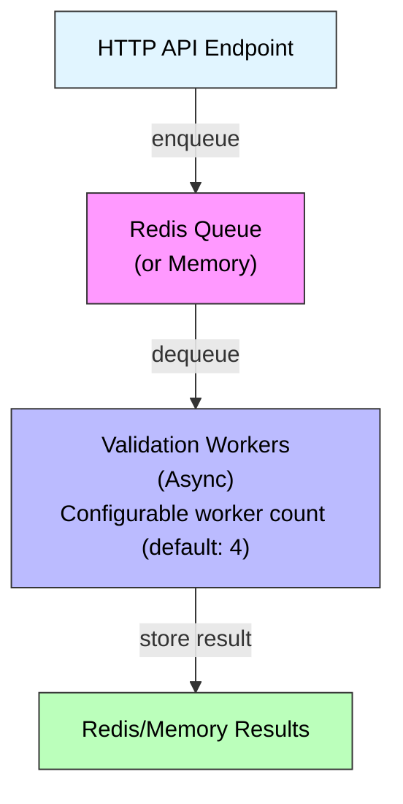

# Three-Phase Registration (TPR)

**Version:** 2.1.0+  
**Status:** Production Ready  
**Feature Flag:** `ARCP_TPR`

---

## 📋 Overview

Three-Phase Registration (TPR) is an advanced agent onboarding system that enhances security and reliability by validating agents before they join the registry. Unlike traditional single-step registration, TPR performs comprehensive security and compliance checks asynchronously, ensuring only validated agents can access ARCP resources.

### Why TPR?

**Traditional Registration Problems:**
- ❌ No pre-validation of agent endpoints
- ❌ Invalid agents can be registered
- ❌ Security checks happen after registration
- ❌ No protection against malicious agents
- ❌ Token replay vulnerabilities

**TPR Solutions:**
- ✅ Progressive validation before registration
- ✅ Asynchronous compliance checking
- ✅ Single-use validated tokens
- ✅ Comprehensive security scanning
- ✅ Replay attack protection

---

## 🔄 The Three Phases

### Phase 1: Request Temporary Token

**Purpose:** Initial authentication using agent registration key

**Endpoint:** `POST /auth/agent/request_temp_token`

**Flow:**
```
Agent → ARCP: agent_id, agent_type, agent_key
ARCP validates agent_key
ARCP → Agent: temp_token (15 min, aud=arcp:validate)
```

**Token Details:**
- **Lifetime:** 15 minutes (configurable via `ARCP_TPR_TOKEN_TTL_TEMP`)
- **Audience:** `arcp:validate`
- **Type:** `temp`
- **Purpose:** Authorize validation request

**Example Request:**
```bash
curl -X POST "https://arcp.example.com/auth/agent/request_temp_token" \
  -H "Content-Type: application/json" \
  -d '{
    "agent_id": "security-scanner-001",
    "agent_type": "security",
    "agent_key": "your-registration-key-here"
  }'
```

**Example Response:**
```json
{
  "temp_token": "eyJ0eXAiOiJKV1QiLCJhbGc...",
  "token_type": "bearer",
  "expires_in": 900,
  "message": "Temporary token issued. Use this token to complete agent registration."
}
```

---

### Phase 2: Validate Compliance

**Purpose:** Asynchronous validation of agent security and endpoints

**Endpoint:** `POST /auth/agent/validate_compliance`

**Flow:**
```
Agent → ARCP: validation_request + temp_token + DPoP/mTLS
ARCP enqueues validation job
Validation Worker:
  ├─ Fast security checks (< 3s)
  ├─ Endpoint validation
  ├─ Capability verification
  ├─ Optional: SBOM, attestation, container scan
  └─ Security binding creation
ARCP → Agent: 202 Accepted, validation_id
Agent polls: GET /auth/agent/validation_status/{validation_id}
ARCP → Agent: validated_token (5 min, single-use, aud=arcp:register)
```

**Validation Checks Performed:**

1. **Fast Security Checks** (< 3 seconds):
   - Health endpoint reachability
   - HTTPS enforcement for remote agents
   - Basic connectivity tests

2. **Endpoint Validation**:
   - Contract compliance (required endpoints)
   - Response format validation
   - API capability testing

3. **Capability Verification**:
   - Declared capabilities match implementation
   - Required capabilities present

4. **Security Binding**:
   - Code integrity hash
   - Endpoint fingerprint
   - DPoP JWK thumbprint (if enabled)
   - mTLS SPKI hash (if enabled)

5. **Optional Advanced Checks**:
   - SBOM vulnerability scanning
   - Software attestation verification
   - Container image scanning

**Token Details:**
- **Lifetime:** 5 minutes (configurable via `ARCP_TPR_TOKEN_TTL_VALIDATED`)
- **Audience:** `arcp:register`
- **Type:** `validated`
- **Single-Use:** Consumed atomically during registration
- **Purpose:** Authorize final registration

**Example Request:**
```bash
curl -X POST "https://arcp.example.com/auth/agent/validate_compliance" \
  -H "Content-Type: application/json" \
  -H "Authorization: Bearer <temp_token>" \
  -H "DPoP: <dpop_proof>" \
  -d '{
    "agent_id": "security-scanner-001",
    "agent_type": "security",
    "endpoint": "https://scanner.example.com:8443",
    "capabilities": ["vulnerability_scan", "threat_detection"],
    "public_key": "your-public-key-min-32-chars",
    "context_brief": "Enterprise security scanner",
    "version": "2.1.0"
  }'
```

**Example Response (202 Accepted):**
```json
{
  "validation_id": "val_abc123def456",
  "status": "pending",
  "message": "Validation request accepted and queued for processing",
  "poll_url": "/auth/agent/validation/val_abc123def456",
  "estimated_completion_seconds": 30
}
```

**Polling for Results:**
```bash
curl "https://arcp.example.com/auth/agent/validation/val_abc123def456" \
  -H "Authorization: Bearer <temp_token>"
```

**Success Response:**
```json
{
  "validation_id": "val_abc123def456",
  "status": "passed",
  "validated_token": "eyJ0eXAiOiJKV1QiLCJhbGc...",
  "token_type": "bearer",
  "expires_in": 300,
  "message": "Agent validation passed. Use validated token to complete registration.",
  "checks_performed": {
    "fast_checks": "passed",
    "endpoint_validation": "passed",
    "capability_verification": "passed",
    "security_binding": "created"
  }
}
```

**Failure Response:**
```json
{
  "validation_id": "val_abc123def456",
  "status": "failed",
  "errors": [
    {
      "check": "endpoint_validation",
      "endpoint": "/health",
      "error": "Endpoint returned 404 Not Found"
    }
  ],
  "warnings": [
    {
      "check": "capability_verification",
      "message": "Capability 'advanced_analysis' not fully implemented"
    }
  ]
}
```

---

### Phase 3: Complete Registration

**Purpose:** Final registration with validated token

**Endpoint:** `POST /agents/register`

**Flow:**
```
Agent → ARCP: registration_data + validated_token + DPoP/mTLS
ARCP validates token audience (arcp:register)
ARCP atomically consumes validation token (single-use)
ARCP creates agent record
ARCP → Agent: access_token (60 min, aud=arcp:operations)
```

**Token Details:**
- **Lifetime:** 60 minutes (configurable via `ARCP_TPR_TOKEN_TTL_ACCESS`)
- **Audience:** `arcp:operations`
- **Type:** `access`
- **Purpose:** Access ARCP operations

**Example Request:**
```bash
curl -X POST "https://arcp.example.com/agents/register" \
  -H "Content-Type: application/json" \
  -H "Authorization: Bearer <validated_token>" \
  -H "DPoP: <dpop_proof>" \
  -d '{
    "agent_id": "security-scanner-001",
    "name": "Enterprise Security Scanner",
    "agent_type": "security",
    "endpoint": "https://scanner.example.com:8443",
    "capabilities": ["vulnerability_scan", "threat_detection"],
    "context_brief": "Enterprise security scanner for infrastructure",
    "description": "Automated security scanning and threat detection",
    "owner": "security-team",
    "public_key": "your-public-key-min-32-chars",
    "version": "2.1.0",
    "communication_mode": "remote",
    "metadata": {
      "department": "security",
      "location": "datacenter-1",
      "environment": "production"
    }
  }'
```

**Example Response:**
```json
{
  "agent_id": "security-scanner-001",
  "status": "registered",
  "access_token": "eyJ0eXAiOiJKV1QiLCJhbGc...",
  "token_type": "bearer",
  "expires_in": 3600,
  "message": "Agent registered successfully",
  "registered_at": "2026-02-16T10:30:00Z"
}
```

---

## ⚙️ Configuration

### Feature Flag

```bash
# Enable/disable TPR
ARCP_TPR=true  # false = legacy registration, true = three-phase
```

### Token Lifetimes

```bash
# Phase 1: Temporary token (seconds)
ARCP_TPR_TOKEN_TTL_TEMP=900  # 15 minutes

# Phase 2: Validated token (seconds)
ARCP_TPR_TOKEN_TTL_VALIDATED=300  # 5 minutes

# Phase 3: Access token (seconds)
ARCP_TPR_TOKEN_TTL_ACCESS=3600  # 60 minutes
```

### Token Audiences

```bash
# Audience values for token validation
ARCP_TPR_TOKEN_AUD_VALIDATE=arcp:validate
ARCP_TPR_TOKEN_AUD_REGISTER=arcp:register
ARCP_TPR_TOKEN_AUD_OPERATIONS=arcp:operations
```

### Validation Timeouts

```bash
# Fast checks timeout (seconds)
ARCP_TPR_VALIDATION_TIMEOUT_FAST=3

# Full validation timeout (seconds)
ARCP_TPR_VALIDATION_TIMEOUT_FULL=30  # Default: 30s (increase to 300s for production with advanced security checks)
```

### Endpoint Validation

```bash
# Enable endpoint contract validation
ARCP_TPR_ENDPOINT_VALIDATION=true

# Strict mode (fail on warnings)
ARCP_TPR_ENDPOINT_VALIDATION_STRICT=true

# Validation mode: "static" or "dynamic"
ARCP_TPR_ENDPOINT_VALIDATION_MODE=static

# Path to contracts file (for dynamic mode)
ARCP_TPR_ENDPOINT_CONTRACTS_FILE=config/endpoint_contracts.yaml
```

### Rate Limits

```bash
# Requests per minute per endpoint
ARCP_TPR_RATE_LIMIT_TEMP=5       # Temp token requests
ARCP_TPR_RATE_LIMIT_VALIDATE=3   # Validation requests
ARCP_TPR_RATE_LIMIT_REGISTER=2   # Registration requests
```

### Idempotency

```bash
# Idempotency key TTL (seconds)
ARCP_TPR_IDEMPOTENCY_TTL=600  # 10 minutes
```

### Instance Tracking

```bash
# Heartbeat interval (seconds)
ARCP_TPR_HEARTBEAT_INTERVAL=15

# Instance TTL multiplier
ARCP_TPR_INSTANCE_TTL_MULT=3  # TTL = interval × multiplier = 45s
```

### Validation Worker

```bash
# Maximum queue size
ARCP_TPR_VALIDATION_QUEUE_MAX=1000

# Number of worker tasks
ARCP_TPR_VALIDATION_WORKERS=4
```

---

## 🔒 Security Features

### Single-Use Tokens

Validated tokens can only be used once for registration, preventing replay attacks:

```python
# Atomic token consumption (Redis Lua script)
validation_id = extract_from_token(validated_token)
if redis.get(f"val:consumed:{validation_id}"):
    raise TokenAlreadyUsed()
redis.setex(f"val:consumed:{validation_id}", ttl, "1")
```

### Token Binding

Tokens are bound to security credentials (DPoP or mTLS):

```json
{
  "cnf": {
    "jkt": "abc123...",      // DPoP JWK thumbprint
    "x5t#S256": "def456..."  // mTLS certificate hash
  }
}
```

### Audience Validation

Each token phase has a specific audience, preventing token misuse:

```python
# Phase 1 temp token
{"aud": "arcp:validate"}  # Can only call /validate_compliance

# Phase 2 validated token
{"aud": "arcp:register"}  # Can only call /register

# Phase 3 access token
{"aud": "arcp:operations"}  # Can call agent operations
```

---

## 📊 Validation Worker Architecture

### Queue-Based Processing



### Worker Tasks

Each validation runs through these stages:

1. **Fast Checks** (< 3s):
   - Health endpoint check
   - HTTPS enforcement
   - Basic connectivity

2. **Endpoint Validation**:
   - Contract compliance
   - Response validation
   - API testing

3. **Capability Verification**:
   - Declared vs. actual capabilities
   - Required features check

4. **Security Binding Creation**:
   - Code hash generation
   - Endpoint fingerprinting

5. **Optional Integrations**:
   - SBOM scanning
   - Attestation verification
   - Container security scan

---

## 🎯 Best Practices

### Agent Implementation

**1. Implement Required Endpoints:**
```python
# Required endpoints for TPR validation (11 total)
GET  /                                  # Service information and capabilities
GET  /ping                              # Service discovery and availability
GET  /health                            # Basic health check
GET  /health/detailed                   # Comprehensive health check
GET  /metrics                           # Prometheus metrics
POST /agents/{agent_id}/heartbeat       # Receive heartbeat from ARCP
POST /agents/report-metrics/{agent_id}  # Report metrics to ARCP
POST /connection/request                # Handle connection request from client
POST /connection/configure              # Configure connection with client
GET  /connection/status/{user_id}       # Check connection status
POST /connection/disconnect             # Disconnect client
POST /connection/notify                 # Agent-to-agent notification

# Optional endpoints
POST /agents/{agent_id}/metrics         # Receive metrics from ARCP (optional)
GET  /search/agents                     # Search for other agents (optional)
```

**2. Use HTTPS for Remote Agents:**
```python
# Enforce HTTPS for production
endpoint = "https://agent.example.com:8443"  # ✅ Good
endpoint = "http://agent.example.com:8080"   # ❌ Rejected
```

**3. Handle Validation Polling:**
```python
import asyncio
from arcp import ARCPClient

async def register_with_tpr():
    client = ARCPClient("https://arcp.example.com")
    
    # The client automatically handles all three phases
    # Just call register_agent with agent_key for TPR
    agent = await client.register_agent(
        agent_id="my-agent",
        name="My Agent",
        agent_type="automation",
        endpoint="https://my-agent.example.com",
        capabilities=["data-processing"],
        context_brief="Automation agent",
        version="1.0.0",
        owner="My Org",
        public_key="my-public-key-at-least-32-characters-long",
        communication_mode="remote",
        metadata={"environment": "production"},
        agent_key="your-key"  # TPR automatically triggered when agent_key provided
    )
    
    # Alternative: Manual TPR control for advanced use cases
    # Phase 1: Get temp token
    temp_token = await client.request_temp_token(
        agent_id="my-agent",
        agent_type="automation",
        agent_key="your-key"
    )
    
    # Phase 2: Validate compliance (automatically polls until complete)
    validated_token = await client.validate_compliance(
        agent_id="my-agent",
        agent_type="automation",
        endpoint="https://my-agent.example.com",
        capabilities=["data-processing"],
        metadata={"version": "1.0.0"},
        poll_timeout=300.0,  # Wait up to 5 minutes
        poll_interval=2.0    # Poll every 2 seconds
    )
    
    # Phase 3: Register with validated token
    agent = await client.register_agent(
        agent_id="my-agent",
        name="My Agent",
        agent_type="automation",
        endpoint="https://my-agent.example.com",
        capabilities=["data-processing"],
        context_brief="Automation agent",
        version="1.0.0",
        owner="My Org",
        public_key="my-public-key-at-least-32-characters-long",
        communication_mode="remote",
        metadata={"environment": "production"},
        skip_validation=True  # Already validated in Phase 2
    )
```

**4. Implement Security Bindings:**
```python
# Use DPoP or mTLS
from arcp.examples.dpop_client import DPoPARCPClient

client = DPoPARCPClient(
    "https://arcp.example.com",
    dpop_enabled=True
)
```

### Server Configuration

**Development:**
```bash
# Relaxed validation for testing
ARCP_TPR=true
ARCP_TPR_ENDPOINT_VALIDATION_STRICT=false
ARCP_TPR_VALIDATION_TIMEOUT_FULL=60
DPOP_REQUIRED=false
MTLS_REQUIRED_REMOTE=false
```

**Production:**
```bash
# Strict security
ARCP_TPR=true
ARCP_TPR_ENDPOINT_VALIDATION_STRICT=true
ARCP_TPR_VALIDATION_TIMEOUT_FULL=300  # Increase from default 30s for advanced security checks
DPOP_REQUIRED=true
MTLS_REQUIRED_REMOTE=true
JWKS_ENABLED=true
```

---

## 🐛 Troubleshooting

### Common Issues

**1. Validation Fails - Endpoint Unreachable**
```json
{
  "status": "failed",
  "errors": [{
    "check": "fast_checks",
    "endpoint": "/health",
    "error": "Connection timeout"
  }]
}
```

**Solution:**
- Ensure agent is running and accessible
- Check firewall rules
- Verify endpoint URL is correct
- Use HTTPS for remote agents

**2. Token Already Used**
```json
{
  "type": "https://arcp.0x001.tech/docs/problems/token-invalid",
  "title": "Token Invalid",
  "detail": "Validated token has already been consumed"
}
```

**Solution:**
- Validated tokens are single-use
- Request new validation if registration fails
- Don't retry registration with same token

**3. DPoP Required But Not Provided**
```json
{
  "type": "https://arcp.0x001.tech/docs/problems/dpop-required",
  "title": "DPoP Proof Required"
}
```

**Solution:**
- Enable DPoP in your client
- Include DPoP header in all requests
- See [DPoP Guide](./dpop.md)

**4. Validation Timeout**
```json
{
  "status": "timeout",
  "message": "Validation did not complete within 30 seconds"
}
```

**Solution:**
- Increase `ARCP_TPR_VALIDATION_TIMEOUT_FULL` (default: 30s, recommended: 300s for production)
- Optimize agent endpoint response times
- Check network latency

---

## 📚 Related Documentation

- [DPoP (Proof-of-Possession)](./dpop.md)
- [mTLS Client Certificates](./mtls.md)
- **[NGINX Deployment](../deployment/nginx.md)** - NGINX configuration for TPR with mTLS
- [SBOM Verification](./sbom.md)
- [Container Scanning](./container-scanning.md)
- [Software Attestation](./attestation.md)
- [API Reference - Agent Registration](../api-reference/rest-api.md#complete-agent-registration-flow)

---

## 🔄 Migration from Legacy Registration

### Backward Compatibility

TPR is **fully backward compatible**. Legacy registration still works when `ARCP_TPR=false`:

```bash
# Legacy registration (single-step)
POST /agents/register
```

### Gradual Rollout

1. **Phase 1:** Enable TPR but keep it optional
   ```bash
   ARCP_TPR=true
   DPOP_REQUIRED=false
   MTLS_REQUIRED_REMOTE=false
   ```

2. **Phase 2:** Require security bindings
   ```bash
   ARCP_TPR=true
   DPOP_REQUIRED=true  # or MTLS_REQUIRED_REMOTE=true
   ```

3. **Phase 3:** Strict validation
   ```bash
   ARCP_TPR=true
   ARCP_TPR_ENDPOINT_VALIDATION_STRICT=true
   DPOP_REQUIRED=true
   MTLS_REQUIRED_REMOTE=true
   ```

### Client Migration

Update your client code:

```python
# Before (v2.0.x)
agent = await client.register_agent(agent_data)

# After (v2.1.0+) - TPR automatically handled
agent = await client.register_agent(agent_data)
```

The ARCP Python client automatically detects TPR and performs all three phases transparently.

---

## 📈 Performance Considerations

### Validation Queue

- **Queue Size:** 1000 requests (configurable)
- **Workers:** 4 concurrent workers (configurable)
- **Throughput:** ~240 validations/hour with default settings

### Caching

Validation results are cached for the token TTL:
- Redis: Persistent, distributed
- Fallback: In-memory (single-instance only)

### Scaling

For high-throughput deployments:

```bash
# Increase workers
ARCP_TPR_VALIDATION_WORKERS=8

# Increase queue size
ARCP_TPR_VALIDATION_QUEUE_MAX=5000

# Use Redis for distributed queue
REDIS_HOST=redis-cluster.example.com
```

---

**Last Updated:** February 16, 2026  
**Version:** 2.1.0
