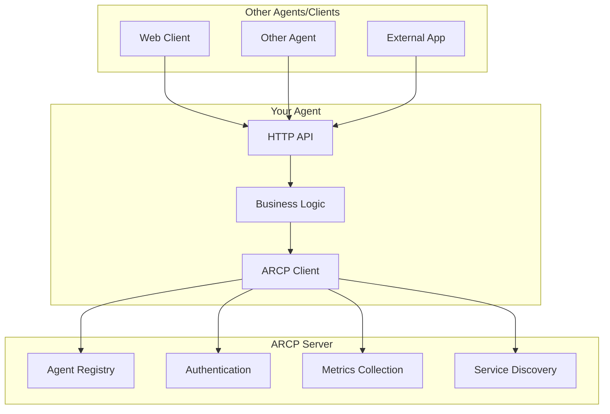

# Agent Development Guide

This comprehensive guide shows you how to build agents that integrate with ARCP. You'll learn the complete agent lifecycle, from registration to communication, with working examples.

## 🎯 What is an ARCP Agent?

An ARCP agent is any service or application that:

- **Registers** with the ARCP server to announce its capabilities
- **Maintains** a heartbeat to show it's alive
- **Reports** metrics about its performance
- **Responds** to connection requests from other agents or clients
- **Communicates** through HTTP APIs or WebSockets

## 🏗️ Agent Architecture



## 🚀 Quick Start: Your First Agent

Let's build a simple echo agent that demonstrates all the key concepts.

### Step 1: Create the Agent

```python
# echo_agent.py
import asyncio
import time
from datetime import datetime
from typing import Dict, Any

import os
import uvicorn
from fastapi import FastAPI, HTTPException
from fastapi.middleware.cors import CORSMiddleware
from pydantic import BaseModel

from arcp import ARCPClient, AgentRequirements

# Agent configuration
AGENT_CONFIG = {
    "agent_id": "echo-agent-001",
    "name": "Echo Agent",
    "agent_type": "testing",
    "endpoint": "http://localhost:8080",
    "capabilities": ["echo", "reverse", "uppercase", "lowercase"],
    "context_brief": "A simple echo agent that processes text messages",
    "version": "1.0.0",
    "owner": "ARCP Examples",
    "agent_key": "test-agent-001"  # From your ARCP configuration
}

# FastAPI app for the agent's HTTP API
app = FastAPI(
    title="Echo Agent",
    description="A simple echo agent for ARCP",
    version=AGENT_CONFIG["version"]
)

dev_mode = os.getenv("ENVIRONMENT", "").lower() in {"dev", "development"}
allowed_origins = [
    "http://localhost:8001",
    "http://127.0.0.1:8001",
    "http://localhost:3000",
    "http://127.0.0.1:3000",
]

app.add_middleware(
    CORSMiddleware,
    allow_origins=["*"] if dev_mode else allowed_origins,
    allow_credentials=False,
    allow_methods=["*"],
    allow_headers=["*"],
)

# Pydantic models for API requests
class EchoRequest(BaseModel):
    message: str
    operation: str = "echo"  # echo, reverse, uppercase, lowercase

class EchoResponse(BaseModel):
    result: str
    operation: str
    timestamp: str
    agent_id: str

# Global ARCP client
arcp_client = None
heartbeat_task = None

@app.get("/")
async def agent_info():
    """Agent information endpoint"""
    return {
        "agent_id": AGENT_CONFIG["agent_id"],
        "name": AGENT_CONFIG["name"],
        "type": AGENT_CONFIG["agent_type"],
        "version": AGENT_CONFIG["version"],
        "capabilities": AGENT_CONFIG["capabilities"],
        "status": "running",
        "endpoint": AGENT_CONFIG["endpoint"]
    }

@app.get("/health")
async def health_check():
    """Health check endpoint"""
    return {
        "status": "healthy",
        "agent_id": AGENT_CONFIG["agent_id"],
        "timestamp": datetime.now().isoformat()
    }

@app.get("/ping")
async def ping():
    """Lightweight ping endpoint for probes"""
    return {
        "status": "ok",
        "agent_id": AGENT_CONFIG["agent_id"],
        "timestamp": datetime.now().isoformat(),
    }

@app.post("/echo", response_model=EchoResponse)
async def echo_service(request: EchoRequest):
    """Main echo service endpoint"""
    start_time = time.time()

    try:
        # Process the message based on operation
        if request.operation == "echo":
            result = request.message
        elif request.operation == "reverse":
            result = request.message[::-1]
        elif request.operation == "uppercase":
            result = request.message.upper()
        elif request.operation == "lowercase":
            result = request.message.lower()
        else:
            raise HTTPException(status_code=400, detail=f"Unknown operation: {request.operation}")

        response_time = time.time() - start_time

        # Report metrics to ARCP
        if arcp_client:
            try:
                await arcp_client.update_metrics(AGENT_CONFIG["agent_id"], {
                    "operation": request.operation,
                    "response_time": response_time,
                    "success": True,
                    "timestamp": datetime.now().isoformat()
                })
            except Exception as e:
                print(f"Failed to report metrics: {e}")

        return EchoResponse(
            result=result,
            operation=request.operation,
            timestamp=datetime.now().isoformat(),
            agent_id=AGENT_CONFIG["agent_id"]
        )

    except HTTPException:
        # Re-raise HTTP exceptions (like 400 for unknown operations)
        raise
    except Exception as e:
        # Report error metrics for unexpected errors
        if arcp_client:
            try:
                await arcp_client.update_metrics(AGENT_CONFIG["agent_id"], {
                    "operation": request.operation,
                    "response_time": time.time() - start_time,
                    "success": False,
                    "error": str(e),
                    "timestamp": datetime.now().isoformat()
                })
            except:
                pass

        raise HTTPException(status_code=500, detail=str(e))

@app.post("/connection/request")
async def handle_connection_request(request: Dict[str, Any]):
    """Handle connection requests from ARCP clients"""
    print(f"   Connection request from: {request.get('user_id', 'unknown')}")
    print(f"   Display name: {request.get('display_name', 'unknown')}")
    print(f"   Endpoint: {request.get('user_endpoint', 'unknown')}")

    # In a real agent, you would:
    # 1. Validate the connection request
    # 2. Check user permissions
    # 3. Establish a connection session
    # 4. Return connection details

    return {
        "status": "accepted",
        "message": f"Connection accepted for {request.get('display_name', 'user')}",
        "agent_info": {
            "name": AGENT_CONFIG["name"],
            "capabilities": AGENT_CONFIG["capabilities"],
            "endpoint": AGENT_CONFIG["endpoint"]
        },
        "next_steps": [
            f"POST {AGENT_CONFIG['endpoint']}/echo with JSON: {{'message': 'hello', 'operation': 'echo'}}",
            f"Available operations: {', '.join(AGENT_CONFIG['capabilities'])}"
        ]
    }

async def register_with_arcp():
    """Register this agent with ARCP"""
    global arcp_client, heartbeat_task

    try:
        # Create ARCP client
        arcp_client = ARCPClient("http://localhost:8001")
        await arcp_client.__aenter__()

        print("Registering with ARCP...")

        # Register the agent
        agent = await arcp_client.register_agent(
            agent_id=AGENT_CONFIG["agent_id"],
            name=AGENT_CONFIG["name"],
            agent_type=AGENT_CONFIG["agent_type"],
            endpoint=AGENT_CONFIG["endpoint"],
            capabilities=AGENT_CONFIG["capabilities"],
            context_brief=AGENT_CONFIG["context_brief"],
            version=AGENT_CONFIG["version"],
            owner=AGENT_CONFIG["owner"],
            public_key="echo-agent-public-key-0123456789abcdef0123456789abcd",  # >= 32 chars
            communication_mode="remote",
            metadata={
                "framework": "fastapi",
                "language": "python",
                "created_at": datetime.now().isoformat(),
                "example_usage": f"curl -X POST {AGENT_CONFIG['endpoint']}/echo -H 'Content-Type: application/json' -d '{{\"message\": \"hello\", \"operation\": \"echo\"}}'"
            },
            features=["http-api", "json-responses", "metrics-reporting"],
            max_tokens=1000,
            language_support=["en"],
            rate_limit=100,
            requirements=AgentRequirements(
                system_requirements=["Python 3.11+", "FastAPI", "Uvicorn"],
                permissions=["http-server"],
                dependencies=["fastapi", "pydantic", "uvicorn", "arcp"],
                minimum_memory_mb=256,
                requires_internet=True,
                network_ports=["8080"]
            ),
            policy_tags=["utility", "demo", "example"],
            agent_key=AGENT_CONFIG["agent_key"]
        )

        print(f"   Agent registered: {agent.name}")
        print(f"   Status: {agent.status}")
        print(f"   Registered at: {agent.registered_at}")

        # Start heartbeat task
        heartbeat_task = await arcp_client.start_heartbeat_task(
            AGENT_CONFIG["agent_id"], 
            interval=30.0
        )
        print("Heartbeat task started")

        return True

    except Exception as e:
        print(f"Registration failed: {e}")
        return False

async def cleanup():
    """Clean up resources"""
    global arcp_client, heartbeat_task

    print("Cleaning up...")

    # Stop heartbeat
    if heartbeat_task and not heartbeat_task.done():
        heartbeat_task.cancel()
        print("Heartbeat stopped")

    # Unregister from ARCP
    if arcp_client:
        try:
            await arcp_client.unregister_agent(AGENT_CONFIG["agent_id"])
            print("Unregistered from ARCP")

            await arcp_client.__aexit__(None, None, None)
            print("ARCP client closed")
        except Exception as e:
            print(f"Cleanup error: {e}")

async def main():
    """Main function"""
    print("Starting Echo Agent")
    print("=" * 50)

    # Register with ARCP
    if not await register_with_arcp():
        print("Failed to register with ARCP - exiting")
        return

    print(f"Agent API available at: {AGENT_CONFIG['endpoint']}")
    print("Test commands:")
    print(f"   curl {AGENT_CONFIG['endpoint']}/")
    print(f"   curl {AGENT_CONFIG['endpoint']}/health")
    print(f"   curl -X POST {AGENT_CONFIG['endpoint']}/echo -H 'Content-Type: application/json' -d '{{\"message\": \"Hello ARCP!\", \"operation\": \"echo\"}}'")
    print("=" * 50)

    # Start the FastAPI server
    config = uvicorn.Config(
        app,
        host="0.0.0.0",
        port=8080,
        log_level="info"
    )
    server = uvicorn.Server(config)

    try:
        await server.serve()
    except KeyboardInterrupt:
        print("\nShutdown requested")
    finally:
        await cleanup()

if __name__ == "__main__":
    asyncio.run(main())
```

### Step 2: Run the Agent

```bash
# Install dependencies
pip install fastapi uvicorn arcp-py

# Run the agent
python echo_agent.py
```

### Step 3: Test the Agent

```bash
# Test agent info
curl http://localhost:8080/

# Test health check
curl http://localhost:8080/health

# Test echo service
curl -X POST http://localhost:8080/echo \
  -H "Content-Type: application/json" \
  -d '{"message": "Hello ARCP!", "operation": "echo"}'

# Test reverse operation
curl -X POST http://localhost:8080/echo \
  -H "Content-Type: application/json" \
  -d '{"message": "Hello ARCP!", "operation": "reverse"}'
```

## 🏗️ Agent Architecture Patterns

### 1. Simple HTTP Agent

```python
# simple_agent.py
from fastapi import FastAPI
from arcp import ARCPClient

app = FastAPI()

@app.get("/")
async def root():
    return {"message": "Hello from my agent!"}

# Register with ARCP
async def register():
    client = ARCPClient("http://localhost:8001")
    await client.register_agent(
        agent_id="simple-agent",
        name="Simple Agent",
        agent_type="testing",
        endpoint="http://localhost:8080",
        capabilities=["hello"],
        context_brief="A simple hello agent",
        version="1.0.0",
        owner="ARCP Examples",
        public_key="simple-agent-public-key-0123456789abcdef0123456789ab",
        communication_mode="remote",
        metadata={
            "description": "Simple hello agent example",
            "framework": "fastapi",
            "language": "python",
        },
        agent_key="test-agent-001",
    )
```

### 2. WebSocket Agent

```python
# websocket_agent.py
import asyncio
import json
from datetime import datetime
from fastapi import FastAPI, WebSocket, WebSocketDisconnect
from arcp import ARCPClient

app = FastAPI()

@app.websocket("/ws")
async def websocket_endpoint(websocket: WebSocket):
    await websocket.accept()
    
    while True:
        try:
            # Receive message
            data = await websocket.receive_text()
            message = json.loads(data)
            
            # Process message
            response = {
                "type": "response",
                "data": f"Echo: {message.get('text', '')}",
                "timestamp": datetime.now().isoformat()
            }
            
            # Send response
            await websocket.send_text(json.dumps(response))
            
        except WebSocketDisconnect:
            print("WebSocket disconnected")
            break
        except Exception as e:
            await websocket.send_text(json.dumps({
                "type": "error",
                "message": str(e)
            }))
```

### 3. Background Task Agent

```python
# background_agent.py
import asyncio
import time
from fastapi import FastAPI, BackgroundTasks
from arcp import ARCPClient

app = FastAPI()

async def background_task(task_id: str):
    """Background task that runs independently"""
    for i in range(10):
        print(f"Task {task_id}: Step {i+1}/10")
        await asyncio.sleep(1)
    print(f"Task {task_id}: Completed")

@app.post("/start-task")
async def start_task(background_tasks: BackgroundTasks):
    task_id = f"task-{int(time.time())}"
    background_tasks.add_task(background_task, task_id)
    return {"task_id": task_id, "status": "started"}
```

## 🔧 Agent Development Best Practices

### 1. Error Handling

```python
from fastapi import FastAPI, HTTPException
from pydantic import BaseModel, ValidationError
import time

class ProcessRequest(BaseModel):
    data: str

async def process_business_logic(data: str) -> str:
    """Mock business logic that might fail"""
    if data == "invalid":
        raise ValueError("Invalid data provided")
    return f"Processed: {data}"

async def report_metrics(operation: str, success: bool, response_time: float, error: str = None):
    """Mock metrics reporting function"""
    print(f"Metrics: {operation} success={success} time={response_time:.3f}s error={error}")

@app.post("/api/process")
async def process_data(request: ProcessRequest):
    start_time = time.time()
    
    try:
        # Your business logic here
        result = await process_business_logic(request.data)
        response_time = time.time() - start_time
        
        # Report success metrics
        await report_metrics("process", True, response_time)
        
        return {"result": result, "status": "success"}
        
    except ValidationError as e:
        # Report validation error
        response_time = time.time() - start_time
        await report_metrics("process", False, response_time, error="validation")
        raise HTTPException(status_code=400, detail=str(e))
        
    except ValueError as e:
        # Report business logic error
        response_time = time.time() - start_time
        await report_metrics("process", False, response_time, error="business_logic")
        raise HTTPException(status_code=400, detail=str(e))
        
    except Exception as e:
        # Report general error
        response_time = time.time() - start_time
        await report_metrics("process", False, response_time, error="internal")
        raise HTTPException(status_code=500, detail="Internal server error")
```

### 2. Metrics Reporting

```python
async def report_metrics(operation: str, success: bool, response_time: float, error: str = None):
    """Report metrics to ARCP"""
    if not arcp_client:
        return
    
    try:
        metrics_data = {
            "operation": operation,
            "response_time": response_time,
            "success": success,
            "timestamp": datetime.now().isoformat()
        }
        
        if error:
            metrics_data["error"] = error
        
        await arcp_client.update_metrics(AGENT_CONFIG["agent_id"], metrics_data)
        
    except Exception as e:
        print(f"Failed to report metrics: {e}")
```

### 3. Health Checks

```python
@app.get("/health")
async def health_check():
    """Comprehensive health check"""
    health_status = {
        "status": "healthy",
        "timestamp": datetime.now().isoformat(),
        "agent_id": AGENT_CONFIG["agent_id"],
        "checks": {}
    }
    
    # Check ARCP connection
    try:
        if arcp_client:
            health = await arcp_client.health_check()
            health_status["checks"]["arcp"] = "connected"
        else:
            health_status["checks"]["arcp"] = "disconnected"
    except:
        health_status["checks"]["arcp"] = "error"
    
    # Check database connection (if applicable)
    try:
        # Your database health check
        health_status["checks"]["database"] = "connected"
    except:
        health_status["checks"]["database"] = "error"
    
    # Check external services (if applicable)
    try:
        # Your external service health check
        health_status["checks"]["external_service"] = "connected"
    except:
        health_status["checks"]["external_service"] = "error"
    
    # Determine overall health
    if any(check == "error" for check in health_status["checks"].values()):
        health_status["status"] = "unhealthy"
    
    return health_status
```

### 4. Configuration Management

```python
# config.py
import os
from typing import List, Optional

class AgentConfig:
    def __init__(self):
        # Agent identification
        self.agent_id = os.getenv("AGENT_ID", "my-agent")
        self.name = os.getenv("AGENT_NAME", "My Agent")
        self.agent_type = os.getenv("AGENT_TYPE", "utility")
        self.version = os.getenv("AGENT_VERSION", "1.0.0")
        self.owner = os.getenv("AGENT_OWNER", "Unknown")
        
        # Network configuration
        self.host = os.getenv("AGENT_HOST", "0.0.0.0")
        self.port = int(os.getenv("AGENT_PORT", "8080"))
        self.endpoint = os.getenv("AGENT_ENDPOINT", f"http://localhost:{self.port}")
        
        # ARCP configuration
        self.arcp_url = os.getenv("ARCP_URL", "http://localhost:8001")
        self.agent_key = os.getenv("AGENT_KEY", "test-agent-001")
        
        # Capabilities
        self.capabilities = os.getenv("AGENT_CAPABILITIES", "basic").split(",")
        
        # Features
        self.features = os.getenv("AGENT_FEATURES", "http-api").split(",")
        
        # Metadata
        self.metadata = {
            "framework": os.getenv("AGENT_FRAMEWORK", "fastapi"),
            "language": os.getenv("AGENT_LANGUAGE", "python"),
            "environment": os.getenv("ENVIRONMENT", "development")
        }

# Usage
config = AgentConfig()
```

### 5. Graceful Shutdown

```python
import signal
import asyncio

class GracefulShutdown:
    def __init__(self):
        self.shutdown_event = asyncio.Event()
        self.setup_signal_handlers()
    
    def setup_signal_handlers(self):
        """Setup signal handlers for graceful shutdown"""
        def signal_handler(signum, frame):
            print("Shutdown signal received")
            self.shutdown_event.set()
        
        signal.signal(signal.SIGINT, signal_handler)
        signal.signal(signal.SIGTERM, signal_handler)
    
    async def wait_for_shutdown(self):
        """Wait for shutdown signal"""
        await self.shutdown_event.wait()

# Usage in main function
async def start_agent():
    print("Agent started")
    
async def cleanup():
    print("Cleaning up...")

# Usage in main function
async def main():
    shutdown = GracefulShutdown()
    
    # Start your agent
    await start_agent()
    
    # Wait for shutdown signal
    await shutdown.wait_for_shutdown()
    
    # Cleanup
    await cleanup()
```

## 🔌 Agent Communication Patterns

### 1. Request-Response Pattern

```python
@app.post("/api/process")
async def process_request(request: ProcessRequest):
    """Standard request-response pattern"""
    # Process the request
    result = await process_data(request.data)
    
    # Return response
    return ProcessResponse(
        result=result,
        status="success",
        timestamp=datetime.now().isoformat()
    )
```

### 2. WebSocket Real-time Communication

```python
@app.websocket("/ws")
async def websocket_endpoint(websocket: WebSocket):
    await websocket.accept()
    
    try:
        while True:
            # Receive message
            data = await websocket.receive_text()
            message = json.loads(data)
            
            # Process message
            response = await process_websocket_message(message)
            
            # Send response
            await websocket.send_text(json.dumps(response))
            
    except WebSocketDisconnect:
        print("WebSocket disconnected")
```

### 3. Event-Driven Pattern

```python
import asyncio
from typing import Dict, Callable

class EventBus:
    def __init__(self):
        self.handlers: Dict[str, List[Callable]] = {}
    
    def subscribe(self, event_type: str, handler: Callable):
        """Subscribe to an event type"""
        if event_type not in self.handlers:
            self.handlers[event_type] = []
        self.handlers[event_type].append(handler)
    
    async def publish(self, event_type: str, data: Any):
        """Publish an event"""
        if event_type in self.handlers:
            for handler in self.handlers[event_type]:
                try:
                    await handler(data)
                except Exception as e:
                    print(f"Error in event handler: {e}")

# Usage
event_bus = EventBus()

@event_bus.subscribe("data_processed")
async def handle_data_processed(data):
    # Handle the event
    await notify_arcp(data)

@app.post("/api/process")
async def process_data(request: ProcessRequest):
    result = await process_business_logic(request.data)
    
    # Publish event
    await event_bus.publish("data_processed", result)
    
    return {"result": result}
```

## 📊 Advanced Agent Features

### 1. Agent-to-Agent Communication

```python
async def communicate_with_other_agent(target_agent_id: str, message: dict):
    """Communicate with another agent through ARCP"""
    try:
        # Get target agent info
        target_agent = await arcp_client.get_agent(target_agent_id)
        
        # Send request to target agent
        async with httpx.AsyncClient() as client:
            response = await client.post(
                f"{target_agent.endpoint}/api/process",
                json=message,
                timeout=30.0
            )
            
            if response.status_code == 200:
                return response.json()
            else:
                raise Exception(f"Agent communication failed: {response.status_code}")
                
    except Exception as e:
        print(f"Failed to communicate with agent {target_agent_id}: {e}")
        raise
```

### 2. Agent Discovery and Load Balancing

```python
async def find_best_agent(capability: str, agent_type: str = None):
    """Find the best agent for a specific capability"""
    try:
        # Search for agents with the required capability
        results = await arcp_client.search_agents(
            query=f"agents with {capability} capability",
            capabilities=[capability],
            agent_type=agent_type,
            weighted=True,  # Use reputation scores
            top_k=5
        )
        
        if not results:
            raise Exception(f"No agents found with capability: {capability}")
        
        # Select the best agent (highest similarity + reputation)
        best_agent = results[0]
        
        # Verify agent is alive
        agent_details = await arcp_client.get_agent(best_agent.id)
        if agent_details.status != "alive":
            raise Exception(f"Best agent {best_agent.id} is not alive")
        
        return best_agent
        
    except Exception as e:
        print(f"Failed to find agent: {e}")
        raise
```

### 3. Agent Clustering and Failover

```python
class AgentCluster:
    def __init__(self, capability: str, agent_type: str = None):
        self.capability = capability
        self.agent_type = agent_type
        self.agents = []
        self.current_index = 0
    
    async def update_agents(self):
        """Update the list of available agents"""
        try:
            results = await arcp_client.search_agents(
                query=f"agents with {self.capability} capability",
                capabilities=[self.capability],
                agent_type=self.agent_type,
                top_k=10
            )
            
            # Filter only alive agents
            self.agents = [
                agent for agent in results 
                if agent.status == "alive"
            ]
            
            print(f"Updated cluster: {len(self.agents)} agents available")
            
        except Exception as e:
            print(f"Failed to update agent cluster: {e}")
    
    async def get_next_agent(self):
        """Get the next available agent (round-robin)"""
        if not self.agents:
            await self.update_agents()
        
        if not self.agents:
            raise Exception(f"No agents available for capability: {self.capability}")
        
        # Round-robin selection
        agent = self.agents[self.current_index]
        self.current_index = (self.current_index + 1) % len(self.agents)
        
        return agent
    
    async def execute_with_failover(self, request: dict):
        """Execute request with automatic failover"""
        max_retries = len(self.agents)
        
        for attempt in range(max_retries):
            try:
                agent = await self.get_next_agent()
                result = await self.execute_on_agent(agent, request)
                return result
                
            except Exception as e:
                print(f"Attempt {attempt + 1} failed: {e}")
                
                # Remove failed agent from cluster
                if agent in self.agents:
                    self.agents.remove(agent)
                
                if attempt == max_retries - 1:
                    raise Exception(f"All agents failed for capability: {self.capability}")
        
        raise Exception("Unexpected error in failover logic")
```

## 🧪 Testing Your Agent

### 1. Unit Tests

```python
# test_agent.py
import pytest
from fastapi.testclient import TestClient
from echo_agent import app

client = TestClient(app)

def test_agent_info():
    response = client.get("/")
    assert response.status_code == 200
    assert response.json()["agent_id"] == "echo-agent-001"

def test_health_check():
    response = client.get("/health")
    assert response.status_code == 200
    assert response.json()["status"] == "healthy"

def test_echo_service():
    response = client.post("/echo", json={
        "message": "Hello",
        "operation": "echo"
    })
    assert response.status_code == 200
    assert response.json()["result"] == "Hello"

def test_reverse_operation():
    response = client.post("/echo", json={
        "message": "Hello",
        "operation": "reverse"
    })
    assert response.status_code == 200
    assert response.json()["result"] == "olleH"
```

### 2. Integration Tests

```python
# test_integration.py
import pytest
import asyncio
from arcp import ARCPClient

@pytest.mark.asyncio
async def test_agent_registration():
    """Test agent registration with ARCP"""
    client = ARCPClient("http://localhost:8001")
    
    try:
        # Register agent
        agent = await client.register_agent(
            agent_id="test-agent",
            name="Test Agent",
            agent_type="testing",
            endpoint="http://localhost:8080",
            capabilities=["test"],
            context_brief="Test agent",
            version="1.0.0",
            owner="Test Owner",
            public_key="test-agent-public-key-0123456789abcdef0123456789abcd",
            communication_mode="remote",
            metadata={
                "framework": "fastapi",
                "language": "python",
                "description": "Integration test agent"
            },
            agent_key="test-agent-001"
        )
        
        assert agent.agent_id == "test-agent"
        assert agent.status == "alive"
        
        # Verify agent is discoverable
        agents = await client.discover_agents()
        assert any(a.agent_id == "test-agent" for a in agents)
        
    finally:
        # Cleanup
        try:
            await client.unregister_agent("test-agent")
        except:
            pass
        await client.__aexit__(None, None, None)
```

### 3. Load Testing

```python
# load_test.py
import asyncio
import httpx
import time

async def load_test_agent(endpoint: str, num_requests: int = 100):
    """Load test the agent"""
    async with httpx.AsyncClient() as session:
        tasks = []
        
        for i in range(num_requests):
            task = asyncio.create_task(
                session.post(
                    f"{endpoint}/echo",
                    json={"message": f"Request {i}", "operation": "echo"}
                )
            )
            tasks.append(task)
        
        start_time = time.time()
        responses = await asyncio.gather(*tasks)
        end_time = time.time()
        
        # Analyze results
        successful = sum(1 for r in responses if hasattr(r, 'status_code') and r.status_code == 200)
        failed = len(responses) - successful
        total_time = end_time - start_time
        rps = num_requests / total_time
        
        print(f"Load test results:")
        print(f"  Total requests: {num_requests}")
        print(f"  Successful: {successful}")
        print(f"  Failed: {failed}")
        print(f"  Total time: {total_time:.2f}s")
        print(f"  Requests per second: {rps:.2f}")

# Run load test
if __name__ == "__main__":
    asyncio.run(load_test_agent("http://localhost:8080", 100))
```

## 🚀 Deployment

### 1. Docker Deployment

```dockerfile
# Dockerfile
FROM python:3.11-slim

WORKDIR /app

# Install dependencies
COPY requirements.txt .
RUN pip install -r requirements.txt

# Copy application
COPY echo_agent.py .

# Expose port
EXPOSE 8080

# Run the agent
CMD ["python", "echo_agent.py"]
```

```yaml
# docker-compose.yml
version: '3.8'
services:
  echo-agent:
    build: .
    ports:
      - "8080:8080"
    environment:
      - ARCP_URL=http://arcp:8001
      - AGENT_KEY=test-agent-001
    depends_on:
      - arcp
    networks:
      - arcp-network

  arcp:
    image: arcp:latest
    ports:
      - "8001:8001"
    environment:
      - ENVIRONMENT=development
      - JWT_SECRET=your-secret-key
      - ADMIN_USERNAME=ARCP
      - ADMIN_PASSWORD=ARCP
      - ALLOWED_AGENT_TYPES=utility,testing
      - AGENT_KEYS=test-agent-001
    networks:
      - arcp-network

networks:
  arcp-network:
    driver: bridge
```

## 📚 Next Steps

Now that you understand agent development:

1. **[Client Library Guide](client-library.md)** - Learn to use the ARCP client library
2. **[API Reference](../api-reference/rest-api.md)** - Complete API documentation
3. **[WebSocket API Reference](../api-reference/websocket-api.md)** - Real-time communication

## 🆘 Troubleshooting

### Common Issues

#### Agent Registration Fails

```bash
# Check ARCP server is running
curl http://localhost:8001/health

# Check agent key is valid
# Verify AGENT_KEYS in ARCP configuration includes your agent key

# Check agent type is allowed
# Verify ALLOWED_AGENT_TYPES includes your agent type
```

#### Agent Not Discoverable

```bash
# Check agent is registered
curl http://localhost:8001/public/discover

# Check agent heartbeat
# Ensure heartbeat task is running

# Check agent status
# Verify agent shows as "alive" in registry
```

#### Connection Requests Fail

```bash
# Check agent endpoint is accessible
curl http://localhost:8080/health

# Check agent has connection handler
# Verify /connection/request endpoint exists

# Check CORS settings
# Ensure proper CORS configuration
```

## 💡 Tips and Best Practices

1. **Always implement health checks** - Essential for monitoring
2. **Report metrics regularly** - Helps with performance monitoring
3. **Handle errors gracefully** - Improves reliability
4. **Use proper logging** - Essential for debugging
5. **Implement graceful shutdown** - Prevents data loss
6. **Test thoroughly** - Unit, integration, and load tests
7. **Monitor performance** - Use ARCP metrics and external monitoring
8. **Document your API** - Use FastAPI's automatic documentation
9. **Version your agent** - Helps with compatibility
10. **Use environment variables** - Makes deployment flexible

Ready to build more advanced agents? Check out the [Client Library Guide](client-library.md) to learn how to interact with ARCP from your applications!